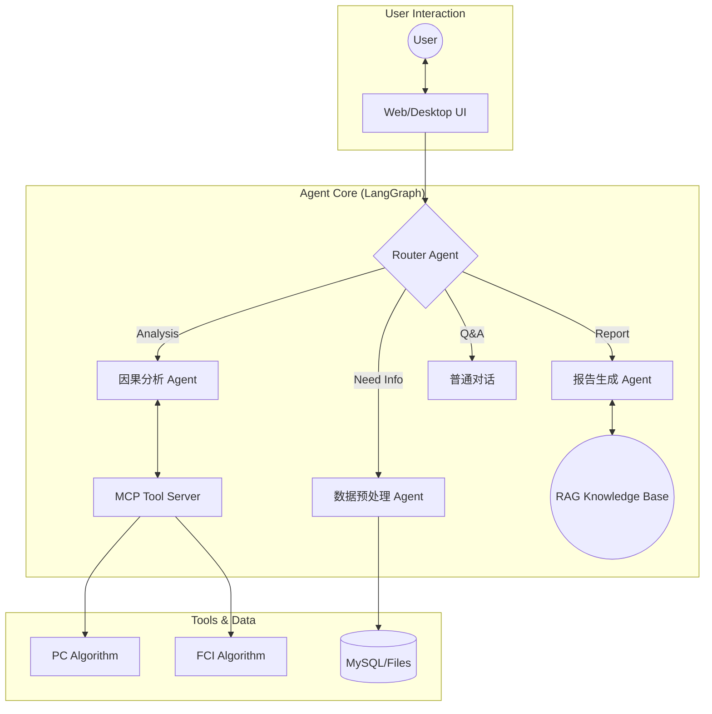

[简体中文](README.md) | [English](README_EN.md)


<p align="center">

</p>

<h1 align="center">
CausalAgent
</h1>

<p align="center">
<em>新一代因果分析智能体</em>
</p>

<p align="center">
    <a href="#">
      
    </a>
    <a href="#">
      
    </a>
    <a href="#">
      
    </a>
    <a href="#">
      
    </a>
  </p>

  <br>

  <p>

*只需上传你的数据集，Causal-Agent 就能以对话的方式，自动帮你选用因果分析算法，并在生成可交互的对话面板和专业的分析报告。*

> [!IMPORTANT]
> **项目开发中**
> <br>
> 目前 CausalAgent 正在进行核心架构升级,我们正在努力完善功能，**请点击右上角 Star ⭐ 关注后续更新！**

## 目录

- [目录](#目录)
- [WHAT IS CausalAgent](#what-is-causalagent)
- [WHY CausalAgent](#why-causalagent)
- [技术栈](#技术栈)
- [展示](#展示)
- [核心功能](#核心功能)
  - [Agent 总览](#agent-总览)
  - [预处理](#预处理)
  - [因果分析（MCP）](#因果分析mcp)
  - [知识库（RAG）](#知识库rag)
  - [后处理](#后处理)
  - [报告生成](#报告生成)
- [快速开始 | Quick Start](#快速开始--quick-start)
  - [Docker部署](#docker部署)
    - [数据库生产化配置](#数据库生产化配置)
  - [windows部署](#windows部署)
- [贡献](#贡献)
- [Star 趋势](#star-趋势)
- [项目结构](#项目结构)


## WHAT IS CausalAgent

**新一代因果分析智能体**: CausalAgent 是一个集成了AGENT的因果分析工具，它能够自动识别因果关系，生成专业的分析报告，并提供可交互的因果图谱。

**缩减因果分析门槛**：什么是因果？为什么需要因果分析？简单来说，[因果分析](https://zh.wikipedia.org/wiki/%E5%9B%A0%E6%9E%9C%E6%8E%A8%E6%96%B7)就是对真实世界数据进行逻辑分析。

## WHY CausalAgent

| 特性 | 说明 |
| :--- | :--- |
| **Agent 驱动** | 基于 LangGraph 的多智能体协作，自动路由任务，无需人工干预算法细节。 |
|  **动态图谱** | 摒弃静态图片，生成可交互的 Network 图谱，支持节点拖拽、点击追问。 |
|  **MCP 架构** | 采用 **Model Context Protocol**，将核心逻辑与工具解耦，极易扩展新算法。 |
|  **RAG 增强** | 内置因果推断领域的专业知识库，确保生成的分析报告学术性与严谨性并存。 |
## 技术栈

| 类别 | 技术组件 |
| :--- | :--- |
| **Core AI** |    |
| **Backend** |    |
| **Frontend** |    |
| **Tools** |   |
## 展示
<p align="center">
  

</p>
<p align="center">
  
</p>

## 核心功能

CausalAgent 的整体因果分析流程可以抽象为：**用户上传数据 → 预处理与数据体检 → 因果结构学习 → 后处理与质量提升 → 报告与可视化输出**。下面按模块进行说明。

### Agent 总览


- **Router Agent**：根据用户意图在「预处理 / 因果分析 / 知识库问答 / 报告生成」等节点之间自动路由，无需用户关心底层算法。
- **Causal Agent**：负责与 MCP 因果算法工具交互（如 PC、FCI 等），完成因果结构学习与干预效应估计的核心推理。
- **Writer Agent**：结合因果结果与 RAG 知识库，自动撰写结构化专业报告（背景、方法、结果、结论与局限性）。
- **Chat Agent**：面向一般问答与解释型对话，为非专业用户提供自然语言解释与操作指引。

### 预处理
*进行基本的数据建模，对数据进行可视化分析，并为后续因果分析做「体检与筛选」*

- **数据概览**：统计数据集的行数、列数和所有字段名，生成统一的表结构摘要，帮助快速理解数据规模与字段含义。
- **列级体检与类型推断**：逐列分析缺失率、唯一值、是否常数列，自动识别连续变量、分类变量、时间变量、疑似 ID 等，并给出每一列在因果分析中的适用性评级（如 *excellent / good / warning*）。
- **质量诊断与因果友好度评估**：汇总整体缺失率，标记高缺失列和常数列，识别高基数分类、疑似 ID 等问题字段，并按适用性分组出「优先用于因果分析」的候选变量列表。
- **可视化摘要**：通过直方图、箱线图、相关性热力图等可视化方式，辅助发现明显异常值和潜在共线性问题。

### 因果分析（MCP）
*基于 MCP（Model Context Protocol）快速迭代因果算法*

- **可插拔算法框架**：通过 MCP 将因果发现与估计算法以「工具」形式解耦，便于在不改动 Agent 主逻辑的前提下扩展/更换算法库。
- **当前支持**：
  - PC 算法（基于条件独立检验的因果结构学习）。
- **规划中**：
  - FCI 等含潜在混杂的结构学习算法；
  - 因果效应估计（ATE/CATE）与反事实分析等模块。

### 知识库（RAG）
*通过嵌入论文与书籍构建因果推断领域知识库，为报告和问答提供专业支撑*

- **嵌入模型**：目前采用 `bge-small-zh-v1.5` 作为中文向量化模型，兼顾性能与效果。
- **知识来源**：使用大量因果推断相关书籍与论文的 PDF / TXT 文档构建，涵盖经典因果图论、干预推断、工具变量、面板因果等主题。
- **典型能力**：
  - 在生成报告时，自动检索相关理论和方法描述，为结论补充严谨的文献背景；
  - 支持面向初学者的「概念解释」，例如“什么是混杂变量”“为什么需要随机试验”等。
- **运行时生命周期**：worker 启动时严格创建一次进程级 `RagRuntime`，集中持有 embedding、Chroma、由 Chroma 文档构建的 BM25s 内存稀疏索引和回答 LLM；同一 worker 的所有 slot 共享该 Runtime，但各自拥有 RAG Tool 和 Agent Graph。生产 Tool 不会在首次查询时加载这些重资源。
- **可选能力降级**：知识库目录、embedding、collection 或 sparse corpus 初始化失败时，worker 仍会领取和处理任务，RAG Tool 返回稳定的“知识库暂不可用”结果，报告继续基于因果分析结果生成。该 worker 进程不会自动重试，修复配置或知识库后需重启 worker。
- **评测兼容**：`query_rag.py` 的既有评测、CLI 和 Web 导入入口仍然保留，并使用独立的 compatibility Service；生产 worker 不经过该兼容缓存。生产检索参数仍逐问题读取发布配置，参数热发布无需重启。
- **多模态公共知识库**：维护者可通过 `python -m Agent.knowledge_base.multimodal.cli` 对离线公共 TXT、Markdown、图片和已配置解析器支持的 PDF 创建隔离暂存索引。它不接入用户上传文件、不修改 PubMedQA；版本只会在完整性与显式质量门禁均通过后切换独立的多模态 active pointer。查询还会校验 active pointer、manifest 与运行期 embedding 指纹，漂移时拒绝检索而不回退到 PubMedQA。
- PDF 当前默认使用已通过本地 smoke 的 Docling；MinerU 仅保留为显式选择时的兼容回退。原始资料、Docling 原始输出、标准化单元与本地资源 URI/内容哈希都写入版本 manifest，并在发布门禁中回读核验。远程视觉仅接受 `wcode.net` 的 `qwen/qwen3-vl-flash` 配置和固定 allowlist 资料。

```bash
python -m Agent.knowledge_base.multimodal.cli inspect --source <path>
python -m Agent.knowledge_base.multimodal.cli ingest --source <path> --allow-remote-data
python -m Agent.knowledge_base.multimodal.cli run --source <path> --allow-remote-data --timeout-seconds 600
python -m Agent.knowledge_base.multimodal.cli evaluate --index-version <version>
python -m Agent.knowledge_base.multimodal.cli publish --index-version <version>
python -m Agent.knowledge_base.multimodal.cli omnidocbench-audit --root Agent/knowledge_base/multimodal_benchmarks/omnidocbench
python -m Agent.knowledge_base.multimodal.omnidocbench_export --root Agent/knowledge_base/multimodal_benchmarks/omnidocbench --output-dir Agent/knowledge_base/multimodal_benchmarks/omnidocbench/official_export
python -m Agent.knowledge_base.multimodal.cli omnidocbench-export-official --root Agent/knowledge_base/multimodal_benchmarks/omnidocbench --selection-manifest Agent/knowledge_base/multimodal_benchmarks/omnidocbench/production_100/production_100_manifest.json --output-dir Agent/knowledge_base/multimodal_benchmarks/omnidocbench/production_100/official_export_docling
```

OmniDocBench 本地固定子集只用于研究验证，当前覆盖 6 页代表样本；生产抽样的 100 页由 `production_100_manifest.json` 固定版本、页面哈希与标注属性。`omnidocbench_export` 可生成官方 end-to-end 所需的 GT JSON、同名页面 Markdown 和哈希 manifest；传入 `--selection-manifest` 时按生产清单导出。100 页 Docling Markdown 已在官方 Docker 运行时完成 end-to-end 评测（文本 Edit Distance、表格 TEDS、公式 CDM、阅读顺序）；该证据只衡量解析器，不证明知识库索引已通过发布门禁。布局 mAP 尚未运行，当前 active 索引仍是旧 manifest，不能发布。完整开发依赖通过 `requirements.txt` 引入 `requirements-multimodal.txt`；基础生产镜像仍不安装多模态解析与测试依赖。详细开发记录见 `README/开发日志.md`。

### 后处理
*对因果图进行后处理，包括环路检测、边合理性评估等，提高因果结构的可解释性与可靠性*

- **环路检测与修正**：检查学习得到的因果图中是否存在违背 DAG（有向无环图）假设的环路；若发现异常，则调用 LLM 辅助判断合理的断边方案，给出修正建议。
- **边评估与置信度分析**：对每一条因果边进行强度或置信度评估，结合数据统计特征和领域常识，对明显不合理的边进行标记与修正建议。
- **结构约束与业务先验融合**：在后处理阶段支持引入业务先验（如「变量 A 不可能被 B 因果影响」），从而得到更符合领域知识的因果图。

### 报告生成
*根据后处理结果生成面向业务方与研究者的专业报告，并配套交互式可视化*

- **自动生成结构化报告**：围绕「分析背景 → 数据概况 → 方法说明 → 因果发现 → 结论与建议 → 局限性」等章节自动撰写自然语言报告。
- **交互式因果图谱**：基于 vis-network 等前端组件生成可交互的因果图，支持节点拖拽、缩放、查看变量说明、点击追问等操作。

## 快速开始 | Quick Start
### Docker部署
当前项目已经提供了完整的 `Dockerfile`，支持通过 Docker 运行后端服务，但暂未在公网镜像仓库发布官方镜像。
如果你已安装 Docker，可以在本地根据下面的步骤自行构建并运行镜像。


1. 安装docker并且gitclone项目
```bash
git clone https://github.com/Heyflyingpig/CausalAgent
```

2. 创建.env文件,并在文件中键入以下值
```bash
# Flask 应用密钥（用于会话加密等）
SECRET_KEY=

# API 基础URL（OpenAI官方或第三方兼容接口）
BASE_URL=
MODEL=
# 可选：第三方 OpenAI 兼容接口通常使用 json_mode。
LLM_STRUCTURED_OUTPUT_METHOD=json_mode

# OpenAI API 密钥或兼容 API 的密钥
API_KEY=
# Docker环境：使用服务名 'mysql'
# 本地开发：使用 'localhost' 或 '127.0.0.1'
MYSQL_HOST=mysql

# 旧版兼容账号。未配置拆分账号时，写/读连接会回退使用它。
MYSQL_USER=pyramid

MYSQL_ROOT_PASSWORD=
MYSQL_PASSWORD=

# 数据库名称
MYSQL_DATABASE=

# 应用写账号：用于主库写入、迁移和数据库就绪检查。
MYSQL_WRITE_USER=pyramid_writer
MYSQL_WRITE_PASSWORD=

# 应用读账号：用于主库/从库业务查询，建议只授予业务库 SELECT。
MYSQL_READ_USER=pyramid_reader
MYSQL_READ_PASSWORD=

# 复制状态检查账号：只用于 SHOW REPLICA STATUS，缺失时 eventual 读会回退主库。
MYSQL_REPLICA_STATUS_USER=replica_status
MYSQL_REPLICA_STATUS_PASSWORD=

# 复制通道账号：只用于从库拉取主库 binlog。
MYSQL_REPLICATION_USER=replica
MYSQL_REPLICATION_PASSWORD=

MYSQL_WRITE_HOST=mysql-primary
MYSQL_READ_HOSTS=mysql-replica

MYSQL_PORT=3306
MYSQL_POOL_SIZE_WRITE=5
MYSQL_POOL_SIZE_READ=5
MYSQL_REPLICA_MAX_LAG_SECONDS=2
MYSQL_QUERY_WARN_MS=500

# Web/后台任务并发配置
WEB_WORKERS=1
WEB_THREADS=12
WEB_TIMEOUT=120
JOB_WORKERS=2
JOB_HEARTBEAT_INTERVAL_SECONDS=10
JOB_STALE_AFTER_SECONDS=120
JOB_MAX_ATTEMPTS=3

MAX_UPLOAD_SIZE_MB=20


# LangSmith API 密钥和项目名称（不强制，兼容原有 LANGCHAIN_* 配置）
LANGCHAIN_API_KEY=
LANGCHAIN_PROJECT=

#可选rag嵌入模型配置
MEDICAL_EMBEDDING_API_KEY=
MEDICAL_EMBEDDING_BASE_URL=
MEDICAL_EMBEDDING_MODEL=

```
3. 在项目根目录运行docker-compose
```bash
docker-compose -f docker-compose.replica.yml up -d
```

4. 运行数据库迁移
```bash
docker-compose -f docker-compose.replica.yml run --rm app python Database/database_init.py
docker-compose -f docker-compose.replica.yml run --rm app alembic upgrade head
```

如果是已有旧数据、准备做生产化升级，再额外先执行：

```bash
docker-compose -f docker-compose.replica.yml run --rm app python Database/audit_before_db_upgrade.py
```

> [!IMPORTANT]
> **知识库仍然在构建，所以知识库查询功能暂不可用**

#### 数据库生产化配置

主从开发：

如果你已经启动过 `mysql-primary` 或 `mysql-replica`，修复后要使用新的空 volume 重建；否则 `/docker-entrypoint-initdb.d` 初始化脚本不会重新执行。

主从模式下数据库账号按职责拆分：

- 写账号：`MYSQL_WRITE_USER` / `MYSQL_WRITE_PASSWORD`，用于应用写主库、Alembic 迁移和启动就绪检查；缺失时兼容回退到 `MYSQL_USER` / `MYSQL_PASSWORD`。
- 读账号：`MYSQL_READ_USER` / `MYSQL_READ_PASSWORD`，用于 `get_read_connection()` 的主库强一致读和从库弱一致读；缺失时兼容回退到 `MYSQL_USER` / `MYSQL_PASSWORD`。
- 复制状态检查账号：`MYSQL_REPLICA_STATUS_USER` / `MYSQL_REPLICA_STATUS_PASSWORD`，只用于读取 `SHOW REPLICA STATUS`；缺失或不可用时，`eventual` 读安全回退主库读连接。
- 复制通道账号：`MYSQL_REPLICATION_USER` / `MYSQL_REPLICATION_PASSWORD`，只用于 MySQL 主从复制链路，不参与应用业务查询。

管理接口：

- `GET /api/admin/db/health`
- `GET /api/admin/db/slow-queries`
- `GET /api/admin/jobs/workers`


### windows部署

**不推荐使用windows部署，会有意想不到的问题**

项目采用前后端分离的设计，需要同时运行后端服务和前端应用。

首先推荐创建一个环境，具体创建方式请自行查阅

1. 打开命令行工具。

2. 导航到您想要存放项目的目录。 （例如，如果您想放在 D 盘的 Projects 文件夹下，可以输入 cd /d D:\Projects）

3. 克隆仓库: 输入以下命令并按回车：

  git clone https://github.com/Heyflyingpig/CausalAgent
  这将在当前目录下创建一个名为 CausalAgent 的文件夹，并下载所有项目文件。

*备选方案：您也可以在 GitHub 页面上点击 "Code" -> "Download ZIP" 下载项目的压缩包，然后手动解压。*


4.  **Python 环境**: 确保你已安装 Python 3.11+。

5.  **MySQL 数据库**: 你需要一个正在运行的 MySQL 8.0+ 实例。请预先创建一个数据库（例如，名为 `causal_chat_db`）并准备好其访问凭据（主机、用户名、密码）。

6.  **安装 Python 依赖**:
    克隆项目后，在项目根目录运行以下命令：
    ```bash
    pip install -r requirements.txt
    ```
7. 项目配置

在首次运行前，你必须在项目根目录下创建一个 `.env` 文件，用于存放所有敏感配置信息。

-   创建 `.env` 文件。
-   将以下模板内容复制到文件中，并填入你自己的真实信息。

    ```bash
    # Flask 应用密钥（用于会话加密等）
    SECRET_KEY=

    # API 基础URL（OpenAI官方或第三方兼容接口）
    BASE_URL=
    MODEL=
    # 可选：第三方 OpenAI 兼容接口通常使用 json_mode。
    LLM_STRUCTURED_OUTPUT_METHOD=json_mode

    # OpenAI API 密钥或兼容 API 的密钥
    API_KEY=
    # Docker环境：使用服务名 'mysql'
    # 本地开发：使用 'localhost' 或 '127.0.0.1'
    MYSQL_HOST=mysql

    # 旧版兼容账号。未配置拆分账号时，写/读连接会回退使用它。
    MYSQL_USER=

    MYSQL_ROOT_PASSWORD=
    MYSQL_PASSWORD=

    # 数据库名称
    MYSQL_DATABASE=

    # 应用写账号
    MYSQL_WRITE_USER=
    MYSQL_WRITE_PASSWORD=

    # 应用读账号
    MYSQL_READ_USER=
    MYSQL_READ_PASSWORD=

    # 复制状态检查账号。缺失时 eventual 读回退主库。
    MYSQL_REPLICA_STATUS_USER=
    MYSQL_REPLICA_STATUS_PASSWORD=

    # 复制通道账号
    MYSQL_REPLICATION_USER=replica
    MYSQL_REPLICATION_PASSWORD=

    # LangSmith API 密钥和项目名称（不强制，兼容原有 LANGCHAIN_* 配置）
    LANGCHAIN_API_KEY=
    LANGCHAIN_PROJECT=

    ```

8. 启动数据库
需要预先安装mysql数据库
在项目根目录下打开一个终端，运行以下命令：
```bash
python Database/database_init.py
alembic upgrade head
```
`Database/database_init.py` 负责确保数据库存在和连接可用；业务表结构由 Alembic 迁移脚本维护。全新空库直接执行 `alembic upgrade head` 即可；已有历史数据的环境应先执行审计脚本，确认无孤立消息、孤立附件和非法附件类型后再升级。

9. 启动后端服务

在项目根目录下打开一个终端，运行 Web 层：

```bash
python Causalchat.py
```

再打开一个终端，运行后台 worker：

```bash
python -m app.agent.worker
```

首次运行时，Web 层会检查数据库表结构。Agent/MCP 初始化只在 worker 中执行；如果没有 worker，前端可以创建任务但不会得到最终分析结果。请保持 Web 和 worker 两个终端窗口持续运行。

10. 启动前端应用

再打开一个 **新的终端窗口**，同样在项目根目录下，运行以下命令：

```bash
python Run_causal.py
```

稍等片刻，一个标题为 "CausalAgent" 的桌面应用窗口将会出现，并加载应用的登录界面。现在，你可以注册并开始使用了。

11. rag和知识库部分
> [!IMPORTANT]
> **知识库仍然在构建，所以知识库查询功能暂不可用**

## 贡献
欢迎提交 Issue 和 Pull Request！

1. Fork 本项目

2. 新建 Feat_xxx 分支

3. 提交代码

4. 新建 Pull Request

## Star 趋势

[](https://star-history.com/#Heyflyingpig/CausalAgent&Date)


## 项目结构

```
.
├── Causalchat.py           # Flask 后端入口
├── Run_causal.py           # 桌面端启动入口（pywebview）
├── requirements.txt        # 完整依赖
├── requirements-base.txt   # 基础依赖（docker/生产使用）
├── Dockerfile
├── docker-compose.yml
├── docker-compose.prod.yml
├── docker-compose.replica.yml # MySQL 主从开发拓扑
├── README.md               # 项目说明
├── README/                 # README 图片与更新日志
├── database_init.log       # 数据库初始化日志
├── app/                    # Flask 应用主目录（Blueprint 结构）
│   ├── __init__.py         # 创建 Flask app，注册蓝图
│   ├── db.py               # 数据库会话与连接封装
│   ├── main/               # 通用页面相关路由
│   ├── auth/               # 登录、注册等认证相关路由
│   ├── chat/               # 聊天 & 会话相关路由与服务
│   ├── files/              # 文件上传/管理相关路由
│   └── static/             # 前端静态资源
│       ├── chat.html       # 主聊天界面
│       ├── rag_eval.html   # RAG评测控制台
│       ├── css/
│       ├── js/
│       └── generated_graphs/ # 因果图等生成图像
├── Agent/                  # 因果分析与智能体核心逻辑
│   ├── causal/             # 底层因果发现算法
│   ├── causal_agent/       # langgraph/agent 状态、节点定义
│   ├── Processing/         # 数据预处理、折叠验证、可视化
│   ├── Postprocessing/     # 后处理
│   ├── Report/             # 报告生成逻辑
│   ├── knowledge_base/     # RAG 知识库
│   │   ├── build_knowledge.py # 知识库构建入口，支持 default / medical profile
│   │   ├── rag_runtime.py      # worker 进程级 RAG 重资源初始化与生命周期管理
│   │   ├── rag_service.py      # RAG 查询编排、兼容入口与不可用降级服务
│   │   ├── sparse_retriever.py # 基于 BM25s 的只读内存稀疏检索索引
│   │   ├── query_rag.py    # RAG 查询、检索 trace 与证据生成入口
│   │   ├── multimodal/     # 隔离的资料检查、摄取、索引、发布与检索模块
│   │   ├── db/             # 当前运行时向量知识库存储；医疗库应使用 PubMedQA active corpus 重建
│   │   ├── models/         # 本地嵌入模型，default profile 使用 bge-small-zh-v1.5
│   │   └── rag/            # RAG 测评框架、数据集操作、报告和外部医疗数据
│   │       ├── rag_config.py
│   │       ├── data/
│   │       │   └── external/pubmedqa/
│   │       │       └── processed/
│   │       ├── operation_datasets/
│   │       ├── rag_eval/
│   │       ├── tools/
│   │       └── output/
│   └── tool_node/          # MCP 工具节点封装（task、rag 调用等）
├── Database/               # 数据库初始化与迁移逻辑
│   ├── database_init.py    # 数据库初始化引导脚本
│   ├── audit_before_db_upgrade.py # 数据库生产化升级前审计
│   ├── monitoring.py       # 数据库轻量监控查询
│   ├── agent_connect.py    # Langgraph checkpoint 相关数据库支持
│   ├── mysql/              # MySQL 主从配置与初始化脚本
│   └── migrations/         # Alembic 迁移脚本
├── config/                 # 全局配置
│   └── settings.py
├── setting/                # 用户可见文档
│   ├── manual.md           # 用户手册
│   └── Userprivacy.md      # 用户隐私协议
├── openspec/               # 项目规范与变更说明（内部开发用）
```
