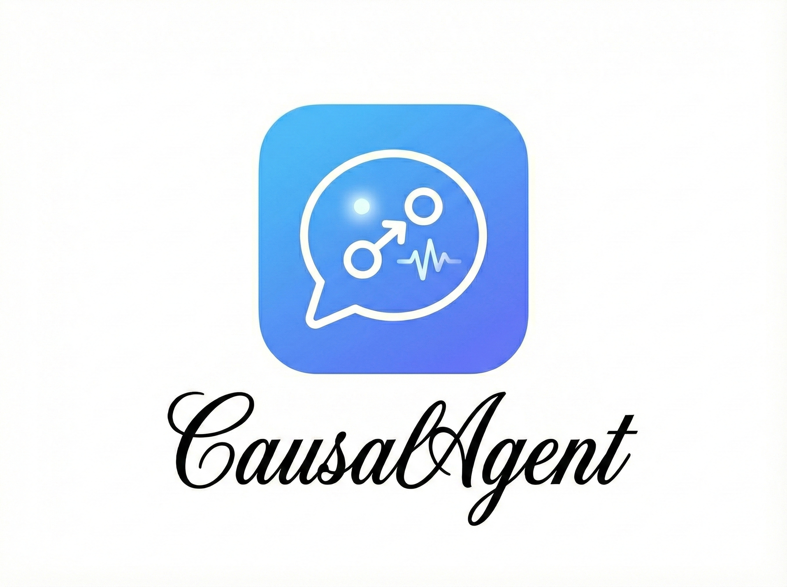
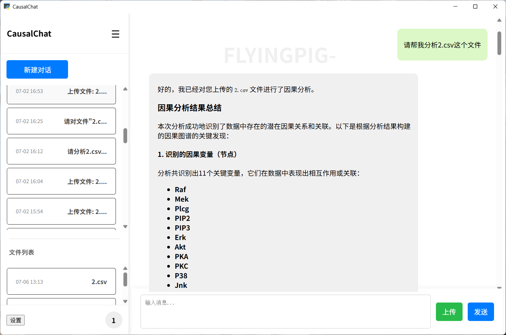
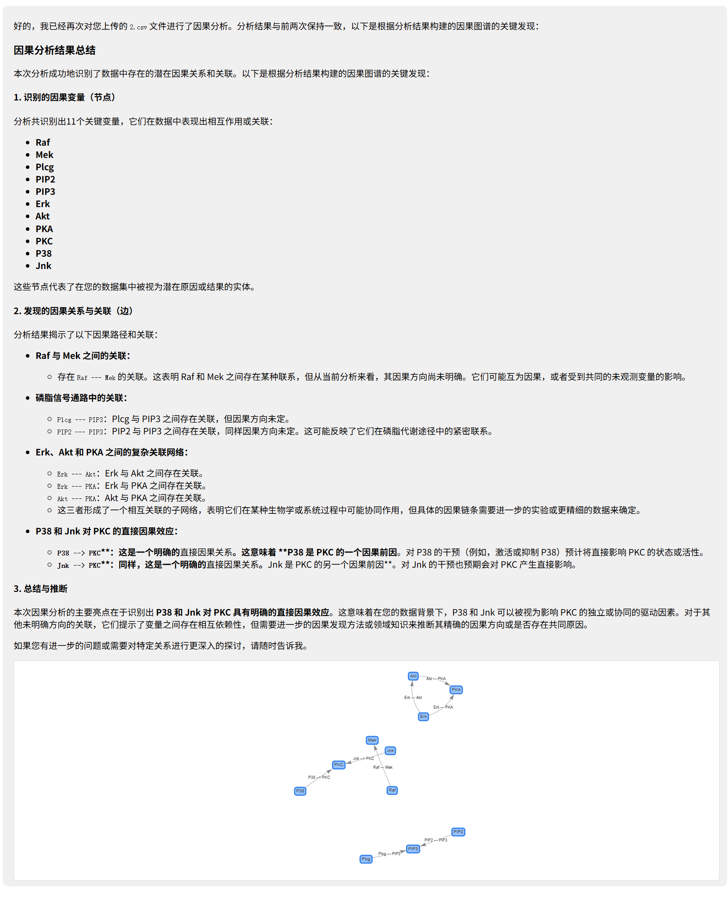
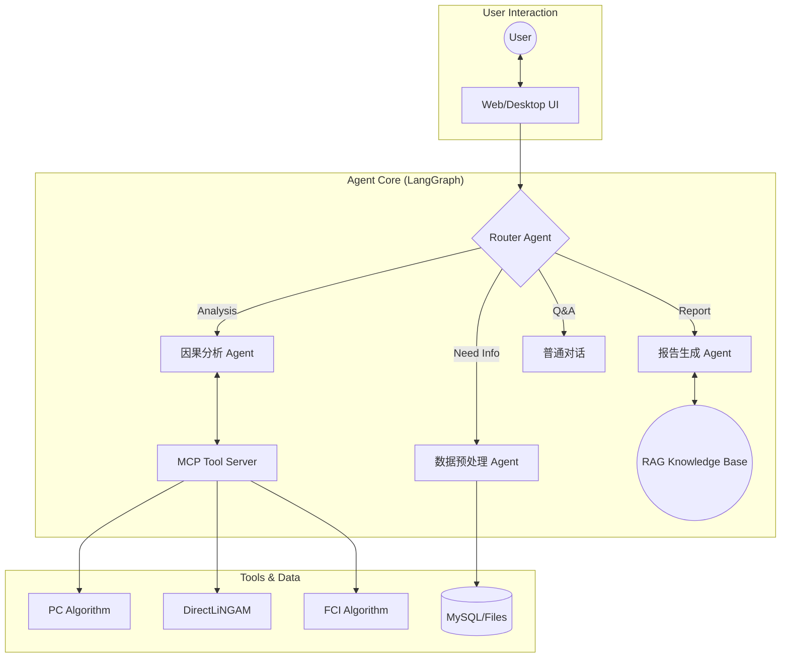

[简体中文](README.md) | [English](README_EN.md)


<p align="center">

</p>

<h1 align="center">
CausalAgent
</h1>

<p align="center">
<em>新一代因果分析智能体</em>
</p>

<p align="center">
    <a href="#">
      
    </a>
    <a href="#">
      
    </a>
    <a href="#">
      
    </a>
    <a href="#">
      
    </a>
  </p>

  <br>

  <p>

*只需上传你的数据集，Causal-Agent 就能以对话的方式，自动帮你选用因果分析算法，并在生成可交互的对话面板和专业的分析报告。*

> [!IMPORTANT]
> **项目开发中**
> <br>
> 目前 CausalAgent 正在进行核心架构升级,我们正在努力完善功能，**请点击右上角 Star ⭐ 关注后续更新！**

## 目录

- [目录](#目录)
- [WHAT IS CausalAgent](#what-is-causalagent)
- [WHY CausalAgent](#why-causalagent)
- [技术栈](#技术栈)
- [展示](#展示)
- [核心功能](#核心功能)
  - [Agent 总览](#agent-总览)
  - [预处理](#预处理)
  - [因果分析（MCP）](#因果分析mcp)
  - [知识库（RAG）](#知识库rag)
  - [后处理](#后处理)
  - [报告生成](#报告生成)
- [快速开始 | Quick Start](#快速开始--quick-start)
  - [Docker部署](#docker部署)
    - [数据库生产化配置](#数据库生产化配置)
    - [管理员后台](#管理员后台)
  - [后端单元测试](#后端单元测试)
  - [windows部署](#windows部署)
- [贡献](#贡献)
- [Star 趋势](#star-趋势)
- [Star History](#star-history)
- [项目结构](#项目结构)


## WHAT IS CausalAgent

**新一代因果分析智能体**: CausalAgent 是一个集成了AGENT的因果分析工具，它能够自动识别因果关系，生成专业的分析报告，并提供可交互的因果图谱。

**缩减因果分析门槛**：什么是因果？为什么需要因果分析？简单来说，[因果分析](https://zh.wikipedia.org/wiki/%E5%9B%A0%E6%9E%9C%E6%8E%A8%E6%96%B7)就是对真实世界数据进行逻辑分析。

## WHY CausalAgent

| 特性 | 说明 |
| :--- | :--- |
| **Agent 驱动** | 基于 LangGraph 的多智能体协作，自动路由任务，无需人工干预算法细节。 |
|  **动态图谱** | 摒弃静态图片，生成可交互的 Network 图谱，支持节点拖拽、点击追问。 |
|  **MCP 架构** | 采用 **Model Context Protocol**，将核心逻辑与工具解耦，极易扩展新算法。 |
|  **RAG 增强** | 内置因果推断领域的专业知识库，确保生成的分析报告学术性与严谨性并存。 |
## 技术栈

| 类别 | 技术组件 |
| :--- | :--- |
| **Core AI** |    |
| **Backend** |    |
| **Frontend** |    |
| **Tools** |   |
## 展示
<p align="center">
  

</p>
<p align="center">
  
</p>

## 核心功能

CausalAgent 的整体因果分析流程可以抽象为：**用户上传数据 → 预处理与数据体检 → 因果结构学习 → 后处理与质量提升 → 报告与可视化输出**。下面按模块进行说明。

### Agent 总览


- **Router Agent**：根据用户意图在「预处理 / 因果分析 / 知识库问答 / 报告生成」等节点之间自动路由，无需用户关心底层算法。
- **Causal Agent**：负责与 MCP 因果算法工具交互（如 PC、FCI 等），完成因果结构学习与干预效应估计的核心推理。
- **Writer Agent**：结合因果结果与 RAG 知识库，自动撰写结构化专业报告（背景、方法、结果、结论与局限性）。
- **Chat Agent**：面向一般问答与解释型对话，为非专业用户提供自然语言解释与操作指引。

### 预处理
*进行基本的数据建模，对数据进行可视化分析，并为后续因果分析做「体检与筛选」*

- **数据概览**：统计数据集的行数、列数和所有字段名，生成统一的表结构摘要，帮助快速理解数据规模与字段含义。
- **列级体检与类型推断**：逐列分析缺失率、唯一值、是否常数列，自动识别连续变量、分类变量、时间变量、疑似 ID 等，并给出每一列在因果分析中的适用性评级（如 *excellent / good / warning*）。
- **质量诊断与因果友好度评估**：汇总整体缺失率，标记高缺失列和常数列，识别高基数分类、疑似 ID 等问题字段，并按适用性分组出「优先用于因果分析」的候选变量列表。
- **可视化摘要**：通过直方图、箱线图、相关性热力图等可视化方式，辅助发现明显异常值和潜在共线性问题。

### 因果分析（MCP）
*基于 MCP（Model Context Protocol）快速迭代因果算法*

- **可插拔算法框架**：通过 MCP 将因果发现与估计算法以「工具」形式解耦，便于在不改动 Agent 主逻辑的前提下扩展/更换算法库。
- **当前支持**：
  - PC 算法（基于条件独立检验的因果结构学习）。
  - DirectLiNGAM（面向连续数值数据的线性非高斯无环因果发现，输出因果顺序与带权有向图）。使用结果时需满足误差相互独立、无潜在混杂等模型假设，边权表示模型估计系数，不等同于实验验证。
- **规划中**：
  - FCI 等含潜在混杂的结构学习算法；
  - 因果效应估计（ATE/CATE）与反事实分析等模块。

### 知识库（RAG）
*通过嵌入论文与书籍构建因果推断领域知识库，为报告和问答提供专业支撑*

- **嵌入模型**：目前采用 `bge-small-zh-v1.5` 作为中文向量化模型，兼顾性能与效果。
- **知识来源**：使用大量因果推断相关书籍与论文的 PDF / TXT 文档构建，涵盖经典因果图论、干预推断、工具变量、面板因果等主题。
- **典型能力**：
  - 在生成报告时，自动检索相关理论和方法描述，为结论补充严谨的文献背景；
  - 支持面向初学者的「概念解释」，例如“什么是混杂变量”“为什么需要随机试验”等。

### 后处理
*对因果图进行后处理，包括环路检测、边合理性评估等，提高因果结构的可解释性与可靠性*

- **环路检测与修正**：检查学习得到的因果图中是否存在违背 DAG（有向无环图）假设的环路；若发现异常，则调用 LLM 辅助判断合理的断边方案，给出修正建议。
- **边评估与置信度分析**：对每一条因果边进行强度或置信度评估，结合数据统计特征和领域常识，对明显不合理的边进行标记与修正建议。
- **结构约束与业务先验融合**：在后处理阶段支持引入业务先验（如「变量 A 不可能被 B 因果影响」），从而得到更符合领域知识的因果图。

### 报告生成
*根据后处理结果生成面向业务方与研究者的专业报告，并配套交互式可视化*

- **自动生成结构化报告**：围绕「分析背景 → 数据概况 → 方法说明 → 因果发现 → 结论与建议 → 局限性」等章节自动撰写自然语言报告。
- **交互式因果图谱**：基于 vis-network 等前端组件生成可交互的因果图，支持节点拖拽、缩放、查看变量说明、点击追问等操作。

## 快速开始 | Quick Start
### Docker部署
当前项目已经提供了完整的多阶段 `Dockerfile`，会先用 Node 24 构建管理员 Vue，再生成仅包含 Python 运行时与静态产物的应用镜像；暂未在公网镜像仓库发布官方镜像。
如果你已安装 Docker，可以在本地根据下面的步骤自行构建并运行镜像。


1. 安装docker并且gitclone项目
```bash
git clone https://github.com/Heyflyingpig/CausalAgent
```

2. 创建并填写.env文件
```bash
cp .env.example .env
```

3. 在项目根目录运行docker-compose
```bash
docker compose -f docker-compose.yml up -d
```

`docker compose ... up -d` 会在 app、worker、monitor 和 cleanup worker 启动前，
自动运行一次性 `db-bootstrap`。它依次执行 MySQL 建库、Alembic migration 和
LangGraph 官方 PostgreSQL setup。若需要手动重跑该初始化入口，可执行：

```bash
docker compose -f docker-compose.yml run --rm db-bootstrap
```

请先在 `.env` 设置非空的 `CHECKPOINT_POSTGRES_PASSWORD`。
`checkpoint-cleanup` 仍是独立的常驻 worker，用于消费跨库清理 outbox。
`app` 负责管理员 checkpoint 摘要读取，`monitor` 负责 PostgreSQL quick/deep
检查，因此两者也必须取得相同的 `CHECKPOINT_POSTGRES_*` 配置。生产 Compose
同样包含 PostgreSQL、bootstrap、worker、monitor 和 cleanup 服务。

全新空库不需要运行升级前审计。只有旧库尚未建立目标外键、且即将执行添加这些外键的迁移时，才先运行：

```bash
docker compose -f docker-compose.yml run --rm app python Database/audit_before_db_upgrade.py
```

> [!IMPORTANT]
> **知识库仍然在构建，所以知识库查询功能暂不可用**

#### 数据库生产化配置

主从开发：

如果你已经启动过 `mysql-primary` 或 `mysql-replica`，修复后要使用新的空 volume 重建；否则 `/docker-entrypoint-initdb.d` 初始化脚本不会重新执行。

主从模式下数据库账号按职责拆分：

- 写账号：`MYSQL_WRITE_USER` / `MYSQL_WRITE_PASSWORD`，用于应用写主库、Alembic 迁移和启动就绪检查；缺失时兼容回退到 `MYSQL_USER` / `MYSQL_PASSWORD`。
- 读账号：`MYSQL_READ_USER` / `MYSQL_READ_PASSWORD`，用于 `get_read_connection()` 的主库强一致读和从库弱一致读；除业务库 `SELECT` 外，仅额外授予 `performance_schema.events_statements_summary_by_digest` 的表级 `SELECT`，供高负载 SQL digest 摘要使用；缺失时兼容回退到 `MYSQL_USER` / `MYSQL_PASSWORD`。
- 复制状态检查账号：`MYSQL_REPLICA_STATUS_USER` / `MYSQL_REPLICA_STATUS_PASSWORD`，只用于读取 `SHOW REPLICA STATUS`；缺失或不可用时，`eventual` 读安全回退主库读连接。
- 复制通道账号：`MYSQL_REPLICATION_USER` / `MYSQL_REPLICATION_PASSWORD`，只用于 MySQL 主从复制链路，不参与应用业务查询。


#### 管理员后台

管理员后台提供业务概览、用户、会话、任务、文件、数据库看板、采集配置和数据库审计。数据库看板通过 URL 查询参数在“数据库运行状态 / Cleanup Worker / Outbox 队列”三段视图间切换；用户删除后可从持续可见的 checkpoint 清理进度区跳转到对应 Operation ID 的 Outbox 排查。普通用户仍进入聊天页面，已启用的管理员登录后进入 `/admin/database`。

管理员仍默认进入 `/admin/database`，也可从后台进入普通聊天界面；聊天页只访问当前账号自己的会话、文件和任务，并向管理员提供返回后台的入口。管理员主动访问 `/` 时不会被再次强制送回后台。

未登录管理页面只保留白名单内的安全回跳；普通用户直访管理页面会得到 `403`。`POST /api/login` 仅在内部 `next` 通过服务端白名单校验后返回 `redirect_to`。

首次使用前，先完成数据库迁移和管理员前端构建，然后把一个已经注册且已启用的用户提升为管理员：

```bash
# Docker 运行
docker compose -f docker-compose.yml run --rm app python -m app.auth.admin_cli promote <username>
```

管理员系统的部署、开发、API、安全边界和测试说明统一放在 [`Document/admin/`](Document/admin/README.md)。其中：

- [API 契约](Document/admin/api.md)
- [开发与部署](Document/admin/development.md)
- [测试说明](Document/admin/testing.md)

任务详情默认显示 MySQL 节点/任务事件，并可通过单视图选择器切换到 PostgreSQL checkpoint 状态。新
checkpoint 通过 `metadata.job_id` 精确关联任务；迁移前记录缺少该字段时只提示
无法可靠归属，不按时间猜测。checkpoint API 只返回安全摘要，不读取状态正文、
blob 或 pending writes。数据库 quick/deep 审计同时覆盖 PostgreSQL checkpoint
连接、官方 schema/setup 版本、估算统计和有界跨库关系样本。

更深入的数据库治理、读写一致性和恢复规则见 [`setting/database_governance.md`](setting/database_governance.md)。

### 后端单元测试

仓库提供独立的 `docker-compose.test.yml`，用于按需创建一次性单元测试容器。测试镜像预装项目 Python 依赖和 `pytest`，不连接 MySQL，禁用网络；当前源码以只读方式挂载到容器，因此修改代码后可以直接重新运行测试，无需重建镜像。

首次使用或测试依赖变化后构建测试镜像：

```bash
docker compose -f docker-compose.test.yml build unit-test
```

运行全部后端单元测试，测试结束后自动删除本次容器：

```bash
docker compose -f docker-compose.test.yml run --rm unit-test
```

运行指定测试文件：

```bash
docker compose -f docker-compose.test.yml run --rm unit-test python -m pytest -p no:cacheprovider tests/unit/agent/test_agent_state_routing.py
```

需要在相同环境内排查导入或依赖问题时，可以临时进入 Shell；退出后容器仍会自动删除：

```bash
docker compose -f docker-compose.test.yml run --rm unit-test sh
```

当前测试只保证 `tests/unit`；集成测试和隔离主从 E2E 的执行边界见 [`tests/README.md`](tests/README.md)。


### windows部署

**目前已不支持windows部署**

## 贡献
欢迎提交 Issue 和 Pull Request！

1. Fork 本项目

2. 从 `develop` 新建工作分支，例如 `feat(rag)/cache`

3. 提交信息与 Pull Request 标题使用 `keyword(function):description` 格式

   支持的 keyword 包括 `feat`、`fix`、`docs`、`refactor`、`test`、`chore`、`ci`、`build`、`perf` 和 `revert`，例如 `fix(chat):修复会话删除异常`。

4. 向 `develop` 新建 Pull Request；只有 `develop` 可以向 `main` 发起合并请求

5. 等待 `Python syntax`、`Light tests` 和 `Pull request policy` 检查通过后再合并

新建 Issue 时请使用仓库提供的 [`Issue Form`](.github/ISSUE_TEMPLATE/issue.yml)，按模板填写背景、问题描述、预期结果、复现步骤、验收标准和环境信息。除附件外的字段为 GitHub 原生必填项，但不限制填写内容；普通贡献者不能选择空白 Issue。

## Star 趋势

## Star History
<a href="https://www.star-history.com/?repos=Heyflyingpig%2FCausalAgent&type=date&legend=top-left">
 <picture>
   <source media="(prefers-color-scheme: dark)" srcset="https://api.star-history.com/chart?repos=Heyflyingpig/CausalAgent&type=date&theme=dark&legend=top-left&sealed_token=vS9LuCPAcO5HBRJ7MqLOBVKGWvmIC8oGUNMsERduenNH5V5akK0TIWWWQljUSlpxn51m9ROc4eqMCHAEbm0hbW_s66HzGJPzNzE_FxjQXN2e1X7bTiWdq9DKNsjtUwfG6z_5jr-PQcnDsaPoirqPbtSM1xAJvkdffet1KAGVfBKq777hNOA2qhwHt2Hp" />
   <source media="(prefers-color-scheme: light)" srcset="https://api.star-history.com/chart?repos=Heyflyingpig/CausalAgent&type=date&legend=top-left&sealed_token=vS9LuCPAcO5HBRJ7MqLOBVKGWvmIC8oGUNMsERduenNH5V5akK0TIWWWQljUSlpxn51m9ROc4eqMCHAEbm0hbW_s66HzGJPzNzE_FxjQXN2e1X7bTiWdq9DKNsjtUwfG6z_5jr-PQcnDsaPoirqPbtSM1xAJvkdffet1KAGVfBKq777hNOA2qhwHt2Hp" />
   
 </picture>
</a>

## 项目结构

```
.
├── CausalAgent.py          # Flask 后端入口
├── Run_causal.py           # 桌面端启动入口（pywebview）
├── requirements.txt        # 完整依赖
├── requirements-base.txt   # 基础依赖（docker/生产使用）
├── requirements-test.txt   # Docker 单元测试依赖
├── Dockerfile
├── docker-compose.yml         # MySQL 主从 + PostgreSQL checkpoint 开发拓扑
├── docker-compose.prod.yml
├── docker-compose.replica.yml # 旧路径兼容副本，不作为默认开发入口
├── docker-compose.test.yml # 按需创建的一次性单元测试环境
├── .github/                 # GitHub Actions 与 Issue 模板
│   ├── workflows/           # GitHub Actions 工作流
│   └── ISSUE_TEMPLATE/      # Issue Form 模板
├── docker-compose.admin-e2e.yml # 3.1/3.2 独立主从 + PostgreSQL 验收覆盖
├── README.md               # 项目说明
├── README/                 # README 图片与更新日志
├── Document/
│   └── admin/              # 管理员 API、开发部署与测试文档
├── admin-frontend/         # Vue 3 + TypeScript 管理员后台
│   ├── src/
│   ├── tests/
│   ├── package.json
│   └── package-lock.json
├── database_init.log       # 数据库初始化日志
├── app/                    # Flask 应用主目录（Blueprint 结构）
│   ├── __init__.py         # 创建 Flask app，注册蓝图
│   ├── db.py               # 数据库会话与连接封装
│   ├── main/               # 通用页面相关路由
│   ├── auth/               # 登录、注册等认证相关路由
│   ├── admin/              # 管理 API、审计服务与受保护 Vue 入口
│   ├── agent/              # 分析任务 API、队列服务与独立 worker
│   │   ├── routes.py       # Web 进程创建任务与订阅 SSE
│   │   ├── job_service.py  # Web、monitor、worker 共享的任务持久化服务
│   │   ├── core.py         # 不持有运行时状态的兼容导入门面
│   │   └── worker/         # python -m app.agent.worker 包入口
│   │       ├── bootstrap.py        # 启动检查与 slot 编排
│   │       ├── runtime.py          # 显式进程/slot runtime
│   │       ├── execution.py        # 单 job 执行与 heartbeat
│   │       ├── event_writer.py     # 顺序事件持久化
│   │       ├── graph_runner.py     # LangGraph 流式执行
│   │       ├── event_adapter.py    # 内部流到公开事件协议
│   │       └── result_presenter.py # 最终结果展示结构
│   ├── chat/               # 聊天 & 会话相关路由与服务
│   ├── files/              # 文件上传/管理相关路由
│   └── static/             # 前端静态资源
│       ├── chat.html       # 主聊天界面
│       ├── css/
│       ├── js/
│       └── generated_graphs/ # 因果图等生成图像
├── Agent/                  # 因果分析与智能体核心逻辑
│   ├── causal/             # 底层因果发现算法
│   ├── causal_agent/       # langgraph/agent 状态、节点定义
│   ├── Processing/         # 数据预处理、折叠验证、可视化
│   ├── Postprocessing/     # 后处理
│   ├── Report/             # 报告生成逻辑
│   ├── knowledge_base/     # RAG 知识库
│   │   ├── build_knowledge.py
|   |   ├── query_rag.py
│   │   ├── db/             # 向量知识库存储
│   │   └── models/         # 嵌入模型
│   └── tool_node/          # MCP 工具节点封装（task、rag 调用等）
├── Database/               # 数据库初始化与迁移逻辑
│   ├── database_init.py    # MySQL 数据库存在性与连接引导
│   ├── bootstrap.py        # MySQL/Alembic/PostgreSQL 统一初始化入口
│   ├── audit_before_db_upgrade.py # 数据库生产化升级前审计
│   ├── inspection.py       # 管理员看板统一只读检查服务
│   ├── deep_audit.py       # 手动 deep 数据库事实审计
│   ├── lifecycle_repair.py # 孤立关系 dry-run/人工确认修复 CLI
│   ├── checkpoint_setup.py # PostgreSQL LangGraph schema 一次性 setup
│   ├── checkpoint_inspection.py # 管理员 PostgreSQL checkpoint 只读与审计
│   ├── checkpoint_cleanup_worker.py # 跨库 checkpoint cleanup outbox worker
│   ├── monitoring.py       # 共享快照存取、调度与兼容接口
│   ├── monitor_settings.py # 在线配置解析、缓存、校验与事务写入
│   ├── monitor_worker.py   # 数据库看板分层采集进程
│   ├── agent_connect.py    # Langgraph checkpoint 相关数据库支持
│   ├── mysql/              # MySQL 主从配置与初始化脚本
│   └── migrations/         # Alembic 迁移脚本
├── config/                 # 全局配置
│   └── settings.py
├── setting/                # 用户可见文档
│   ├── manual.md           # 用户手册
│   └── Userprivacy.md      # 用户隐私协议
├── tests/                  # 后端测试：unit、integration、e2e
│   ├── unit/
│   ├── integration/
│   └── e2e/
├── openspec/               # 项目规范与变更说明（内部开发用）
```
