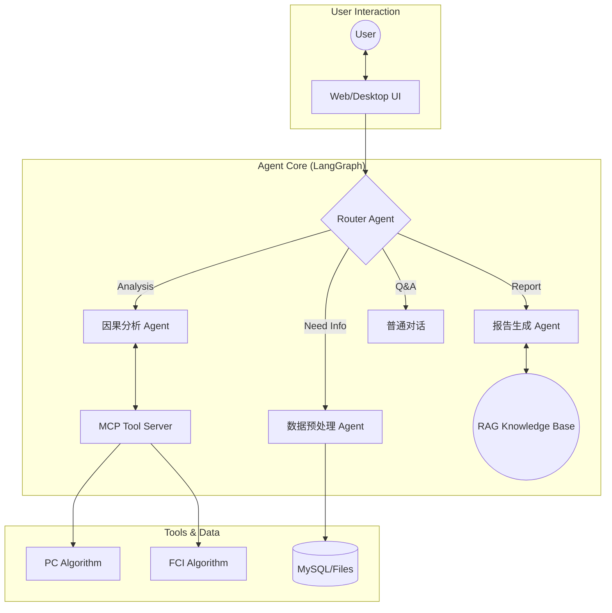

[简体中文](README.md) | [English](README_EN.md)


<p align="center">

</p>

<h1 align="center">
CausalAgent
</h1>

当前 `/rag_eval` 的策略 profile 将 retrieval 与 Ragas 配置统一管理：内置 profile 只读；用户自定义 profile 存储在 MySQL 的 `rag_eval_profiles` 表，可从评测中心另存、保存、删除和发布。正式发布生成 `Agent/knowledge_base/rag/runtime/production_rag_config.json` 快照，历史评测使用各自 `run_manifest.json` 中的完整配置。

<p align="center">
<em>新一代因果分析智能体</em>
</p>

<p align="center">
    <a href="#">
      
    </a>
    <a href="#">
      
    </a>
    <a href="#">
      
    </a>
    <a href="#">
      
    </a>
  </p>

  <br>

  <p>

*只需上传你的数据集，Causal-Agent 就能以对话的方式，自动帮你选用因果分析算法，并在生成可交互的对话面板和专业的分析报告。*

> [!IMPORTANT]
> **项目开发中**
> <br>
> 目前 CausalAgent 正在进行核心架构升级,我们正在努力完善功能，**请点击右上角 Star ⭐ 关注后续更新！**

## 目录

- [目录](#目录)
- [WHAT IS CausalAgent](#what-is-causalagent)
- [WHY CausalAgent](#why-causalagent)
- [技术栈](#技术栈)
- [展示](#展示)
- [核心功能](#核心功能)
  - [Agent 总览](#agent-总览)
  - [预处理](#预处理)
  - [因果分析（MCP）](#因果分析mcp)
  - [知识库（RAG）](#知识库rag)
  - [后处理](#后处理)
  - [报告生成](#报告生成)
- [快速开始 | Quick Start](#快速开始--quick-start)
  - [Docker部署](#docker部署)
    - [数据库生产化配置](#数据库生产化配置)
  - [后端单元测试](#后端单元测试)
  - [windows部署](#windows部署)
- [贡献](#贡献)
- [Star 趋势](#star-趋势)
- [项目结构](#项目结构)
- [更新日志](./README/开发日志.md)


## WHAT IS CausalAgent

**新一代因果分析智能体**: CausalAgent 是一个集成了AGENT的因果分析工具，它能够自动识别因果关系，生成专业的分析报告，并提供可交互的因果图谱。

**缩减因果分析门槛**：什么是因果？为什么需要因果分析？简单来说，[因果分析](https://zh.wikipedia.org/wiki/%E5%9B%A0%E6%9E%9C%E6%8E%A8%E6%96%B7)就是对真实世界数据进行逻辑分析。

## WHY CausalAgent

| 特性 | 说明 |
| :--- | :--- |
| **Agent 驱动** | 基于 LangGraph 的多智能体协作，自动路由任务，无需人工干预算法细节。 |
|  **动态图谱** | 摒弃静态图片，生成可交互的 Network 图谱，支持节点拖拽、点击追问。 |
|  **MCP 架构** | 采用 **Model Context Protocol**，将核心逻辑与工具解耦，极易扩展新算法。 |
|  **RAG 增强** | 内置因果推断领域的专业知识库，确保生成的分析报告学术性与严谨性并存。 |
## 技术栈

| 类别 | 技术组件 |
| :--- | :--- |
| **Core AI** |    |
| **Backend** |    |
| **Frontend** |    |
| **Tools** |   |
## 展示
<p align="center">
  

</p>
<p align="center">
  
</p>

## 核心功能

CausalAgent 的整体因果分析流程可以抽象为：**用户上传数据 → 预处理与数据体检 → 因果结构学习 → 后处理与质量提升 → 报告与可视化输出**。下面按模块进行说明。

### Agent 总览


- **Router Agent**：根据用户意图在「预处理 / 因果分析 / 知识库问答 / 报告生成」等节点之间自动路由，无需用户关心底层算法。
- **Causal Agent**：负责与 MCP 因果算法工具交互（如 PC、FCI 等），完成因果结构学习与干预效应估计的核心推理。
- **Writer Agent**：结合因果结果与 RAG 知识库，自动撰写结构化专业报告（背景、方法、结果、结论与局限性）。
- **Chat Agent**：面向一般问答与解释型对话，为非专业用户提供自然语言解释与操作指引。

### 预处理
*进行基本的数据建模，对数据进行可视化分析，并为后续因果分析做「体检与筛选」*

- **数据概览**：统计数据集的行数、列数和所有字段名，生成统一的表结构摘要，帮助快速理解数据规模与字段含义。
- **列级体检与类型推断**：逐列分析缺失率、唯一值、是否常数列，自动识别连续变量、分类变量、时间变量、疑似 ID 等，并给出每一列在因果分析中的适用性评级（如 *excellent / good / warning*）。
- **质量诊断与因果友好度评估**：汇总整体缺失率，标记高缺失列和常数列，识别高基数分类、疑似 ID 等问题字段，并按适用性分组出「优先用于因果分析」的候选变量列表。
- **可视化摘要**：通过直方图、箱线图、相关性热力图等可视化方式，辅助发现明显异常值和潜在共线性问题。

### 因果分析（MCP）
*基于 MCP（Model Context Protocol）快速迭代因果算法*

- **可插拔算法框架**：通过 MCP 将因果发现与估计算法以「工具」形式解耦，便于在不改动 Agent 主逻辑的前提下扩展/更换算法库。
- **当前支持**：
  - PC 算法（基于条件独立检验的因果结构学习）。
- **规划中**：
  - FCI 等含潜在混杂的结构学习算法；
  - 因果效应估计（ATE/CATE）与反事实分析等模块。

### 知识库（RAG）
*通过嵌入论文与书籍构建因果推断领域知识库，为报告和问答提供专业支撑*

- **嵌入模型**：目前采用 `bge-small-zh-v1.5` 作为中文向量化模型，兼顾性能与效果。
- **知识来源**：支持 PDF、TXT、Markdown、CSV、XLSX 以及 PNG/JPG/JPEG/WEBP/TIF/TIFF 图片；知识源先经过多模态解析与标准化，再进入统一检索链路，涵盖经典因果图论、干预推断、工具变量、面板因果等主题。
- **典型能力**：
  - 在生成报告时，自动检索相关理论和方法描述，为结论补充严谨的文献背景；
  - 支持面向初学者的「概念解释」，例如“什么是混杂变量”“为什么需要随机试验”等。
- **默认生产链路**：使用 `RagRuntime -> RagService -> rag 普通节点`；该节点直接生成问题、调用 Service 并写回结果，不再经过 RAG ToolNode 子图。`rag_enrichment_search` 仅作为兼容工具入口保留。worker 启动时从多模态 active pointer 初始化共享 Runtime，RAG 问题的默认且唯一 corpus 是 `multimodal`。
- **多模态公共知识库**：维护者可通过 `python -m Agent.knowledge_base.multimodal.cli` 对离线公共文本、表格、图片和已配置解析器支持的 PDF 创建隔离暂存索引。解析层会识别正文、版面、表格、公式和图片等内容，并转为带来源定位的多模态知识单元，再写入同一 collection；新图片链只接受冻结公共来源，Runtime 仍会校验来源、manifest 与 embedding 指纹，漂移时拒绝初始化且绝不回退到 PubMedQA。
- **全量摄取与发布**：正式 PDF 使用 `spawn_per_batch` 的低内存 Docling 批处理，并原子保存到候选版本的 `checkpoints.sqlite3`：其中分表保存经 SHA-256 校验的本地版面解析、页元数据和最终单元，支持按页恢复而不产生大量小文件；默认关闭 Docling 图像/表格生成，页面和 `PictureItem` 图片由 PDF bbox 渲染器生成后进入远程 VLM 链路。传入外部 `outbound_manifest.json` 时，远程运行开始前会把它复制并冻结到候选目录；R5 两份冻结 Pearl 来源在远程授权开启时可自动生成本次不可变清单，其他来源仍需显式批准清单。只有完整匹配 source/page/图片哈希/context/策略指纹的记录允许外发。远程失败不回退本地 OCR。Chroma 成功构建后才提交，`run` 默认停在 `ready_to_publish`，只有显式发布才切换 active pointer。
- **空表恢复**：Docling 发现但无法导出的空 `TableItem` 会按页面 bbox 裁剪为 `table_recovery` 资产，与同页正文一起进入同一索引；摄取层依赖 provider-neutral 的 `TableRecoveryProvider`，当前 `RemoteVlmTableRecoveryProvider` 复用已存在的远程视觉 adapter，未来可替换为本地 VLM。恢复失败记录阻断 issue，不生成伪表格单元。
- **Checkpoint 查询**：日常使用 `python scripts/query-multimodal-checkpoints.py --checkpoint-db <候选目录>/checkpoints.sqlite3` 输出概要；加 `--document-id <ID> --page-number <页码>` 查询单页，只有需要查看单元详情时再加 `--include-units`。脚本通过 SQLite 只读连接打开文件，不需要图形化数据库工具。
- **图片链路迁移状态（2026-07-31）**：R3a 已完成两份冻结 Pearl PDF 的 `889/889` 页本地发现，275 条冻结记录已人工审核；R3b 已在单独外发授权下构建候选 `mm_587799887fc8efb68409`，其页覆盖、route、unit/vector/asset/hash 链和 270/275 的远程成功记录均已审计。R4 已从“固定 gold 的通用前置条件”调整为“索引可用性与 RAG 评测解耦”：新知识源先通过页覆盖、资产、hash、unit/vector 与解析错误门禁，再在独立 `/rag_eval` 工作流中以已有问题集或真实用户问题运行 Ragas。固定 Pearl 的 24 条人工题仅作为该公共语料的回归集；当前候选在 `why-003` 发现表格内容未进入 `retrieval_text`，故该回归集未通过，未发布。任一来源、图片哈希、context 或远程策略漂移仍须重新发现、审核和取得外发授权。当前 active `mm_74b5aef2f5e7322b5a79` 未改变。
- **R5/R6 隔离运行台（2026-07-31）**：`/rag_eval` 当前使用 `app/rag_eval/frontend/` 下的 Vue 3 + Vite + TypeScript 页面，生产构建输出到 `app/static/rag_eval_app/`；先提交来源目录 `source_ids` 或显式 `sources`，再在本次 `ingestion_run_id + index_version` 上运行单问题或内联 `rag_eval_v1` 题集。摄取与 RAG 测试分别拥有独立运行目录、状态、SSE 和取消接口；页面不拼接宿主路径，不读取旧评测产物，不打开 active pointer，也不把本次 staged index 发布为生产索引。旧版 `app/static/rag_eval.html`、`app/static/css/rag_eval.css`、`app/static/js/rag_eval.js` 及其旧 `/run`、`/runs/*` 兼容接口已移除；原聊天页仍使用 Flask 静态资源。
- **R5 Evaluation Run（2026-08-02）**：后端新增 `POST /api/rag_eval/isolated/evaluation-runs`，显式绑定 `ingestion_run_id + index_version`，先把任务写入 `rag_eval_jobs` SQL 队列并由独立 `rag-eval-worker` 执行，不再依赖 Web 进程 daemon 线程。worker 通过 heartbeat 租约保活；进程异常退出后，下一次 worker 启动会将超时的 `running` 任务标记为 `failed`，不自动重跑可能产生外部模型调用的 Ragas。结果与 Markdown/JSON 产物通过评测任务结果和 artifact 接口读取，不复用旧 latest 输出；SSE 从运行目录轮询事件，支持 Web 与 worker 跨进程。
- **R5 前端工作台（2026-07-31）**：`/rag_eval` 增加左侧产品导航和“评测中心”面板；面板只绑定当前 staged index，默认先执行 prepare-only 流程，用户显式打开 Ragas judge 后才进入完整评测，报告、事件和产物仍通过隔离 evaluation run 展示。
- **R5 前端评测导航（2026-07-31）**：评测中心拆分为“评测配置、流程报告与指标、评测流程事件、对比分析”四个二级页面；对比页提供时间跨度、粒度、时间趋势/运行 A/B/策略对比三种交互和快捷操作流程，但在隔离评测历史接口与测试源确定前不展示伪造指标。工作台改为纵向分区，左侧导航支持收起并持久化用户偏好。
- **R5 报告编辑与清理**：报告入口统一命名为“报告编辑”，可在同一页面切换流程、检索和 Ragas Markdown；删除已结束评测后，后端会移除对应 `tmp/r5_isolated_runs/<run_id>/` 目录，历史与对比接口不再返回该运行。对超过无事件活动窗口的失活评测，用户确认后可强制删除；仍有活动迹象的运行禁止删除，摄取运行和 staged index 保留。
- **R5 运行配置对比**：对比分析除了指标和样本结果，还会读取两次 evaluation run 各自的 `run_manifest.json`，按路径展示 retrieval、Ragas、策略 profile 和执行步骤的配置差异；不会依赖特定题目或固定 dataset 字段。
- **R5 来源页范围（2026-07-31）**：`/rag_eval` 的运行范围支持按每个来源分别设置 1-based、首尾包含的物理页段，并通过 `page_ranges` 传给隔离摄取接口；快速联调/Smoke 的 `max_pages` 仍是按选中来源顺序累计的总上限。范围会写入 staged manifest，不能绕过隔离目录或发布门禁。
- **R5 知识源上传与删除（2026-08-02）**：工作台支持上传 PDF、TXT、Markdown、CSV、XLSX 和 PNG/JPG/JPEG/WEBP/TIF/TIFF 图片；后端通过 `POST /api/rag_eval/isolated/sources` 按解析器已有格式校验、大小、可读性和 SHA-256，并将来源登记到独立的 `tmp/r5_sources/`（可用 `R5_SOURCE_ROOT` 覆盖）。上传不会自动摄取；用户上传来源可通过 `DELETE /api/rag_eval/isolated/sources/<source_id>` 删除，固定来源、运行中的摄取和已生成的 staged index/评测产物不会被删除。用户选择来源并启动摄取后，R5 内测默认开启远程 VLM；设置 `VISION_ALLOW_REMOTE_DATA=false` 可关闭。
- **Docker Docling 模型路径（2026-07-31）**：`docker-compose.replica.yml` 的 `app`、`worker` 与 `rag-eval-worker` 复用工作区 `Agent/knowledge_base/models/docling`，通过 `MULTIMODAL_DOCLING_ARTIFACTS_DIR=/app/Agent/knowledge_base/models/docling` 加载 Docling 模型；宿主机原始缓存保留为回滚副本。
- **医疗兼容边界**：PubMedQA 构建、数据和专用评测入口暂时保留，但已退出默认生产与默认测试链路，供后续分阶段清理。
- **正式 RAG 测试集契约**：`rag_eval_v1` 现在区分 `gold_regression`、`generated_candidate` 和 `reference_free` 三类题集。Pearl 题集已转换为 `Agent/knowledge_base/rag/data/eval/pearl_gold_v1.json`（24 条），PubMedQA 保留为独立的 `medical_gold_v1.json`（1000 条），两者不能混作同一条默认回归线。可用 `python -m Agent.knowledge_base.rag.operation_datasets.build_eval_datasets` 从历史源文件重新生成。
- **字段含义**：`reference_answer` 是用于回答质量与 Ragas 对比的规范答案；`expected_claims` 是应覆盖的原子事实列表；`gold_evidence` 是由 Runtime metadata 定位的 locator 列表，按已提供字段做严格匹配，推荐使用 `document_id`、`page_number`、`unit_id`、`modality`、`content_kind`、`asset_uri` 等稳定字段。`gold_regression` 必须同时具备三者；缺少 `gold_evidence` 的题集只能作为 `generated_candidate` 或 `reference_free`，检索指标显示为未评分而不是 0。
- **用户自有知识源**：先为本次知识源保存版本/hash 快照，再用 Ragas 生成候选问题和参考答案。只有候选 context 能通过 metadata 或唯一的原文记录映射到 `gold_evidence` 时才具备自动检索 gold；其余保留为候选或 reference-free 观测，不自动提升为正式回归集。正式发布前仍需做去重、证据蕴含校验和少量人工抽查。
- PDF 当前默认使用已通过本地 smoke 的 Docling；MinerU 仅保留为显式选择时的兼容回退。原始资料、Docling 原始输出、标准化单元与本地资源 URI/内容哈希都写入版本 manifest，并在发布门禁中回读核验。远程视觉仅接受 `wcode.net` 的 `qwen/qwen3-vl-8b-instruct` 配置和固定 allowlist 资料。

```bash
python -m Agent.knowledge_base.multimodal.cli inspect --source <path>
# 在实际 Docker worker 中准备 R2 固定 12 页清单（推荐）：
.\scripts\prepare-r2-outbound-manifest.ps1 -MaxPages 12
# R3a: first run the local-only maintenance preflight, then create the full review manifest.
# Neither command sends images or creates a candidate index.
.\scripts\run-r3-maintenance-preflight.ps1
.\scripts\prepare-r3-outbound-manifest.ps1 -OutputFile tmp\r3-review-manifest.json
# R3b only, after manual approval and a separate data-egress authorization:
.\scripts\run-r3-maintenance-preflight.ps1 -RequireVisionConfiguration
# 经人工审阅和数据外发授权后：
python -m Agent.knowledge_base.multimodal.cli run --source <path> --allow-remote-data --outbound-manifest .\tmp\r2-review-manifest.json --max-images 12 --timeout-seconds 600
python -m Agent.knowledge_base.multimodal.cli run --source <path> --allow-remote-data --outbound-manifest <approved-manifest.json> --reuse-local-checkpoints-from <index-version>
python -m Agent.knowledge_base.multimodal.cli evaluate --index-version <version>
python -m Agent.knowledge_base.multimodal.cli publish --index-version <version>
python -m Agent.knowledge_base.multimodal.cli omnidocbench-audit --root Agent/knowledge_base/multimodal_benchmarks/omnidocbench
python -m Agent.knowledge_base.multimodal.omnidocbench_export --root Agent/knowledge_base/multimodal_benchmarks/omnidocbench --output-dir Agent/knowledge_base/multimodal_benchmarks/omnidocbench/official_export
python -m Agent.knowledge_base.multimodal.cli omnidocbench-export-official --root Agent/knowledge_base/multimodal_benchmarks/omnidocbench --selection-manifest Agent/knowledge_base/multimodal_benchmarks/omnidocbench/production_100/production_100_manifest.json --output-dir Agent/knowledge_base/multimodal_benchmarks/omnidocbench/production_100/official_export_docling
```

OmniDocBench 本地固定子集只用于研究验证，当前覆盖 6 页代表样本；生产抽样的 100 页由 `production_100_manifest.json` 固定版本、页面哈希与标注属性。`omnidocbench_export` 可生成官方 end-to-end 所需的 GT JSON、同名页面 Markdown 和哈希 manifest；传入 `--selection-manifest` 时按生产清单导出。100 页 Docling Markdown 已在官方 Docker 运行时完成 end-to-end 评测（文本 Edit Distance、表格 TEDS、公式 CDM、阅读顺序）；该证据只衡量解析器，不证明知识库索引已通过发布门禁。布局 mAP 尚未运行。当前生产 active 索引已发布为 `mm_74b5aef2f5e7322b5a79`；固定 OmniDocBench 子集始终使用隔离索引，不能作为生产知识源发布。完整开发依赖通过 `requirements.txt` 引入 `requirements-multimodal.txt`；基础生产镜像仍不安装多模态解析与测试依赖。详细开发记录见 `README/开发日志.md`。

### 后处理
*对因果图进行后处理，包括环路检测、边合理性评估等，提高因果结构的可解释性与可靠性*

- **环路检测与修正**：检查学习得到的因果图中是否存在违背 DAG（有向无环图）假设的环路；若发现异常，则调用 LLM 辅助判断合理的断边方案，给出修正建议。
- **边评估与置信度分析**：对每一条因果边进行强度或置信度评估，结合数据统计特征和领域常识，对明显不合理的边进行标记与修正建议。
- **结构约束与业务先验融合**：在后处理阶段支持引入业务先验（如「变量 A 不可能被 B 因果影响」），从而得到更符合领域知识的因果图。

### 报告生成
*根据后处理结果生成面向业务方与研究者的专业报告，并配套交互式可视化*

- **自动生成结构化报告**：围绕「分析背景 → 数据概况 → 方法说明 → 因果发现 → 结论与建议 → 局限性」等章节自动撰写自然语言报告。
- **交互式因果图谱**：基于 vis-network 等前端组件生成可交互的因果图，支持节点拖拽、缩放、查看变量说明、点击追问等操作。

### R5 摄取状态恢复

摄取状态持久化在 tmp/r5_isolated_runs/<ingestion_run_id>/run.json，staged index、图片、Chroma 和 manifest 保存在同一运行目录；页级 checkpoint 使用该 index 下的 checkpoints.sqlite3，便于失败后按页复用。GET /api/rag_eval/isolated/ingestion-runs 会枚举这些状态，页面在 localStorage 丢失、首次请求失败或点击顶部刷新后，都会尝试恢复最近的运行中或 staged 状态。评测任务的队列状态在 MySQL `rag_eval_jobs`，具体产物仍在各自的 `tmp/r5_isolated_runs/<run_id>/`；运行目录和上传来源目录已加入 Git 忽略，不应提交到仓库。后端进程重启不会自动续跑已中断的摄取线程；已入队的评测由 `rag-eval-worker` 继续处理，worker 失联则按 heartbeat 超时失败收敛。

## 快速开始 | Quick Start
### Docker部署
当前项目已经提供了完整的多阶段 `Dockerfile`，会先用 Node 24 构建管理员 Vue，再生成仅包含 Python 运行时与静态产物的应用镜像；暂未在公网镜像仓库发布官方镜像。
如果你已安装 Docker，可以在本地根据下面的步骤自行构建并运行镜像。


1. 安装docker并且gitclone项目
```bash
git clone https://github.com/Heyflyingpig/CausalAgent
```

2. 创建.env文件
```bash
cp .env.example .env
# Flask 应用密钥（用于会话加密等）
SECRET_KEY=

# API 基础URL（OpenAI官方或第三方兼容接口）
BASE_URL=
MODEL=
# 可选：第三方 OpenAI 兼容接口通常使用 json_mode。
LLM_STRUCTURED_OUTPUT_METHOD=json_mode

# OpenAI API 密钥或兼容 API 的密钥
API_KEY=
# Docker环境：使用服务名 'mysql'
# 本地开发：使用 'localhost' 或 '127.0.0.1'
MYSQL_HOST=mysql

# 旧版兼容账号。未配置拆分账号时，写/读连接会回退使用它。
MYSQL_USER=pyramid

MYSQL_ROOT_PASSWORD=
MYSQL_PASSWORD=

# 数据库名称
MYSQL_DATABASE=

# 应用写账号：用于主库写入、迁移和数据库就绪检查。
MYSQL_WRITE_USER=pyramid_writer
MYSQL_WRITE_PASSWORD=

# 应用读账号：用于主库/从库业务查询，建议只授予业务库 SELECT。
MYSQL_READ_USER=pyramid_reader
MYSQL_READ_PASSWORD=

# 复制状态检查账号：只用于 SHOW REPLICA STATUS，缺失时 eventual 读会回退主库。
MYSQL_REPLICA_STATUS_USER=replica_status
MYSQL_REPLICA_STATUS_PASSWORD=

# 复制通道账号：只用于从库拉取主库 binlog。
MYSQL_REPLICATION_USER=replica
MYSQL_REPLICATION_PASSWORD=

MYSQL_WRITE_HOST=mysql-primary
MYSQL_READ_HOSTS=mysql-replica

MYSQL_PORT=3306
MYSQL_POOL_SIZE_WRITE=5
MYSQL_POOL_SIZE_READ=5
MYSQL_REPLICA_MAX_LAG_SECONDS=2
MYSQL_QUERY_WARN_MS=500

# Web/后台任务并发配置
WEB_WORKERS=1
WEB_THREADS=12
WEB_TIMEOUT=120
JOB_WORKERS=2
JOB_HEARTBEAT_INTERVAL_SECONDS=10
JOB_STALE_AFTER_SECONDS=120
JOB_MAX_ATTEMPTS=3

MAX_UPLOAD_SIZE_MB=20


# LangSmith API 密钥和项目名称（不强制，兼容原有 LANGCHAIN_* 配置）
LANGCHAIN_API_KEY=
LANGCHAIN_PROJECT=

#可选rag嵌入模型配置
MEDICAL_EMBEDDING_API_KEY=
MEDICAL_EMBEDDING_BASE_URL=
MEDICAL_EMBEDDING_MODEL=
```

3. 在项目根目录运行docker-compose
```bash
docker compose -f docker-compose.yml up -d
```

`docker compose ... up -d` 会在 app、worker、monitor 和 cleanup worker 启动前，
自动运行一次性 `db-bootstrap`。它依次执行 MySQL 建库、Alembic migration 和
LangGraph 官方 PostgreSQL setup。若需要手动重跑该初始化入口，可执行：

```bash
docker compose -f docker-compose.yml run --rm db-bootstrap
```

请先在 `.env` 设置非空的 `CHECKPOINT_POSTGRES_PASSWORD`。
`checkpoint-cleanup` 仍是独立的常驻 worker，用于消费跨库清理 outbox。

全新空库不需要运行升级前审计。只有旧库尚未建立目标外键、且即将执行添加这些外键的迁移时，才先运行：

```bash
docker compose -f docker-compose.yml run --rm app python Database/audit_before_db_upgrade.py
```

> [!IMPORTANT]
> **知识库仍然在构建，所以知识库查询功能暂不可用**

#### 数据库生产化配置

主从开发：

如果你已经启动过 `mysql-primary` 或 `mysql-replica`，修复后要使用新的空 volume 重建；否则 `/docker-entrypoint-initdb.d` 初始化脚本不会重新执行。

主从模式下数据库账号按职责拆分：

- 写账号：`MYSQL_WRITE_USER` / `MYSQL_WRITE_PASSWORD`，用于应用写主库、Alembic 迁移和启动就绪检查；缺失时兼容回退到 `MYSQL_USER` / `MYSQL_PASSWORD`。
- 读账号：`MYSQL_READ_USER` / `MYSQL_READ_PASSWORD`，用于 `get_read_connection()` 的主库强一致读和从库弱一致读；除业务库 `SELECT` 外，仅额外授予 `performance_schema.events_statements_summary_by_digest` 的表级 `SELECT`，供高负载 SQL digest 摘要使用；缺失时兼容回退到 `MYSQL_USER` / `MYSQL_PASSWORD`。
- 复制状态检查账号：`MYSQL_REPLICA_STATUS_USER` / `MYSQL_REPLICA_STATUS_PASSWORD`，只用于读取 `SHOW REPLICA STATUS`；缺失或不可用时，`eventual` 读安全回退主库读连接。
- 复制通道账号：`MYSQL_REPLICATION_USER` / `MYSQL_REPLICATION_PASSWORD`，只用于 MySQL 主从复制链路，不参与应用业务查询。

`/api/new_chat` 生成 ID 后会立即在 MySQL 主库创建会话记录；创建 job、保存聊天、修改标题和上传文件都要求该会话已经存在且属于当前用户，不会根据未知 ID 自动重建。删除已经创建的会话时，主库事务会删除会话、聊天消息和附件，并写入 `checkpoint_cleanup_outbox`；独立 cleanup worker 随后调用 PostgreSQL `adelete_thread()` 清理同一 `session_id` 对应的 LangGraph checkpoint。两个数据库之间不伪造分布式事务，用户接口会明确返回后台清理状态。

#### 管理员后台

管理员后台提供业务概览、用户、会话、任务、文件、数据库看板、采集配置和数据库审计。普通用户仍进入聊天页面，已启用的管理员登录后进入 `/admin/database`。

管理员仍默认进入 `/admin/database`，也可从后台进入普通聊天界面；聊天页只访问当前账号自己的会话、文件和任务，并向管理员提供返回后台的入口。管理员主动访问 `/` 时不会被再次强制送回后台。

未登录管理页面只保留白名单内的安全回跳；普通用户直访管理页面会得到 `403`。`POST /api/login` 仅在内部 `next` 通过服务端白名单校验后返回 `redirect_to`。

首次使用前，先完成数据库迁移和管理员前端构建，然后把一个已经注册且已启用的用户提升为管理员：

```bash
# Docker 运行
docker compose -f docker-compose.yml run --rm app python -m app.auth.admin_cli promote <username>
```

管理员系统的部署、开发、API、安全边界和测试说明统一放在 [`Document/admin/`](Document/admin/README.md)。其中：

- [API 契约](Document/admin/api.md)
- [开发与部署](Document/admin/development.md)
- [测试说明](Document/admin/testing.md)

更深入的数据库治理、读写一致性和恢复规则见 [`setting/database_governance.md`](setting/database_governance.md)。

### 后端单元测试

仓库提供独立的 `docker-compose.test.yml`，用于按需创建一次性单元测试容器。测试镜像预装项目 Python 依赖和 `pytest`，不连接 MySQL，禁用网络；当前源码以只读方式挂载到容器，因此修改代码后可以直接重新运行测试，无需重建镜像。

首次使用或测试依赖变化后构建测试镜像：

```bash
docker compose -f docker-compose.test.yml build unit-test
```

运行全部后端单元测试，测试结束后自动删除本次容器：

```bash
docker compose -f docker-compose.test.yml run --rm unit-test
```

运行指定测试文件：

```bash
docker compose -f docker-compose.test.yml run --rm unit-test python -m pytest -p no:cacheprovider tests/unit/agent/test_agent_state_routing.py
```

需要在相同环境内排查导入或依赖问题时，可以临时进入 Shell；退出后容器仍会自动删除：

```bash
docker compose -f docker-compose.test.yml run --rm unit-test sh
```

当前测试只保证 `tests/unit`；集成测试和隔离主从 E2E 的执行边界见 [`tests/README.md`](tests/README.md)。


### windows部署

**目前已不支持windows部署**

## 贡献
欢迎提交 Issue 和 Pull Request！

1. Fork 本项目

2. 从 `develop` 新建工作分支，例如 `feat(rag)/cache`

3. 提交信息与 Pull Request 标题使用 `keyword(function):description` 格式

   支持的 keyword 包括 `feat`、`fix`、`docs`、`refactor`、`test`、`chore`、`ci`、`build`、`perf` 和 `revert`，例如 `fix(chat):修复会话删除异常`。

4. 向 `develop` 新建 Pull Request；只有 `develop` 可以向 `main` 发起合并请求

5. 等待 `Python syntax`、`Light tests` 和 `Pull request policy` 检查通过后再合并

轻量 CI 不连接数据库、不加载知识库或模型，也不调用外部 API。GitHub 分支保护需要在仓库 `Settings -> Rules -> Rulesets` 中单独启用，并将上述三个检查设置为必需检查。

新建 Issue 时请使用仓库提供的 [`Issue Form`](.github/ISSUE_TEMPLATE/issue.yml)，按模板填写背景、问题描述、预期结果、复现步骤、验收标准和环境信息。除附件外的字段为 GitHub 原生必填项，但不限制填写内容；普通贡献者不能选择空白 Issue。

## Star 趋势

[](https://star-history.com/#Heyflyingpig/CausalAgent&Date)


## 项目结构

```
.
├── CausalAgent.py          # Flask 后端入口
├── Run_causal.py           # 桌面端启动入口（pywebview）
├── requirements.txt        # 完整依赖
├── requirements-base.txt   # 基础依赖（docker/生产使用）
├── requirements-test.txt   # Docker 单元测试依赖
├── Dockerfile
├── docker-compose.yml         # MySQL 主从 + PostgreSQL checkpoint 开发拓扑
├── docker-compose.prod.yml
├── docker-compose.replica.yml # 旧路径兼容副本，不作为默认开发入口
├── docker-compose.test.yml # 按需创建的一次性单元测试环境
├── .github/                 # GitHub Actions 与 Issue 模板
│   ├── workflows/           # GitHub Actions 工作流
│   └── ISSUE_TEMPLATE/      # Issue Form 模板
├── docker-compose.admin-e2e.yml # 3.1/3.2 独立主从验收端口/容器覆盖
├── README.md               # 项目说明
├── README/                 # README 图片与更新日志
├── Document/
│   └── admin/              # 管理员 API、开发部署与测试文档
├── admin-frontend/         # Vue 3 + TypeScript 管理员后台
│   ├── src/
│   ├── tests/
│   ├── package.json
│   └── package-lock.json
├── database_init.log       # 数据库初始化日志
├── app/                    # Flask 应用主目录（Blueprint 结构）
│   ├── __init__.py         # 创建 Flask app，注册蓝图
│   ├── db.py               # 数据库会话与连接封装
│   ├── main/               # 通用页面相关路由
│   ├── auth/               # 登录、注册等认证相关路由
│   ├── admin/              # 管理 API、审计服务与受保护 Vue 入口
│   ├── chat/               # 聊天 & 会话相关路由与服务
│   ├── files/              # 文件上传/管理相关路由
│   ├── rag_eval/           # RAG 评测后端与 Vue 前端源码
│   │   └── frontend/       # Vue 3 + Vite + TypeScript 工程
│   └── static/             # 前端静态资源
│       ├── chat.html       # 主聊天界面
│       ├── rag_eval_app/   # RAG 评测生产构建产物
│       ├── css/
│       ├── js/
│       └── generated_graphs/ # 因果图等生成图像
├── Agent/                  # 因果分析与智能体核心逻辑
│   ├── causal/             # 底层因果发现算法
│   ├── causal_agent/       # langgraph/agent 状态、节点定义
│   ├── Processing/         # 数据预处理、折叠验证、可视化
│   ├── Postprocessing/     # 后处理
│   ├── Report/             # 报告生成逻辑
│   ├── knowledge_base/     # RAG 知识库
│   │   ├── build_knowledge.py # 知识库构建入口，支持 default / medical profile

│   │   ├── rag_runtime.py      # 默认多模态 RAG 重资源初始化与生命周期
│   │   ├── rag_service.py      # 默认 RAG 查询编排与降级服务
│   │   ├── sparse_retriever.py # 默认 BM25s 稀疏索引
│   │   ├── query_rag.py    # 默认 dense/BM25s/rerank/answer 实现
│   │   ├── multimodal/     # 默认资料检查、摄取、索引、发布与检索模块
│   │   ├── db/             # 旧医疗兼容向量库存储

│   │   ├── models/         # 本地嵌入模型，default profile 使用 bge-small-zh-v1.5
│   │   └── rag/            # RAG 测评框架、数据集操作、报告和外部医疗数据
│   │       ├── rag_config.py
│   │       ├── data/
│   │       │   └── external/pubmedqa/
│   │       │       └── processed/
│   │       ├── operation_datasets/
│   │       ├── rag_eval/
│   │       ├── tools/
│   │       └── output/
│   └── tool_node/          # MCP 工具节点封装（task、rag 调用等）
├── Database/               # 数据库初始化与迁移逻辑
│   ├── database_init.py    # MySQL 数据库存在性与连接引导
│   ├── bootstrap.py        # MySQL/Alembic/PostgreSQL 统一初始化入口
│   ├── audit_before_db_upgrade.py # 数据库生产化升级前审计
│   ├── inspection.py       # 管理员看板统一只读检查服务
│   ├── deep_audit.py       # 手动 deep 数据库事实审计
│   ├── lifecycle_repair.py # 孤立关系 dry-run/人工确认修复 CLI
│   ├── checkpoint_setup.py # PostgreSQL LangGraph schema 一次性 setup
│   ├── checkpoint_cleanup_worker.py # 跨库 checkpoint cleanup outbox worker
│   ├── monitoring.py       # 共享快照存取、调度与兼容接口
│   ├── monitor_settings.py # 在线配置解析、缓存、校验与事务写入
│   ├── monitor_worker.py   # 数据库看板分层采集进程
│   ├── agent_connect.py    # Langgraph checkpoint 相关数据库支持
│   ├── mysql/              # MySQL 主从配置与初始化脚本
│   └── migrations/         # Alembic 迁移脚本
├── config/                 # 全局配置
│   └── settings.py
├── setting/                # 用户可见文档
│   ├── manual.md           # 用户手册
│   └── Userprivacy.md      # 用户隐私协议
├── tests/                  # 后端测试：unit、integration、e2e
│   ├── unit/
│   ├── integration/
│   └── e2e/
├── openspec/               # 项目规范与变更说明（内部开发用）
```
