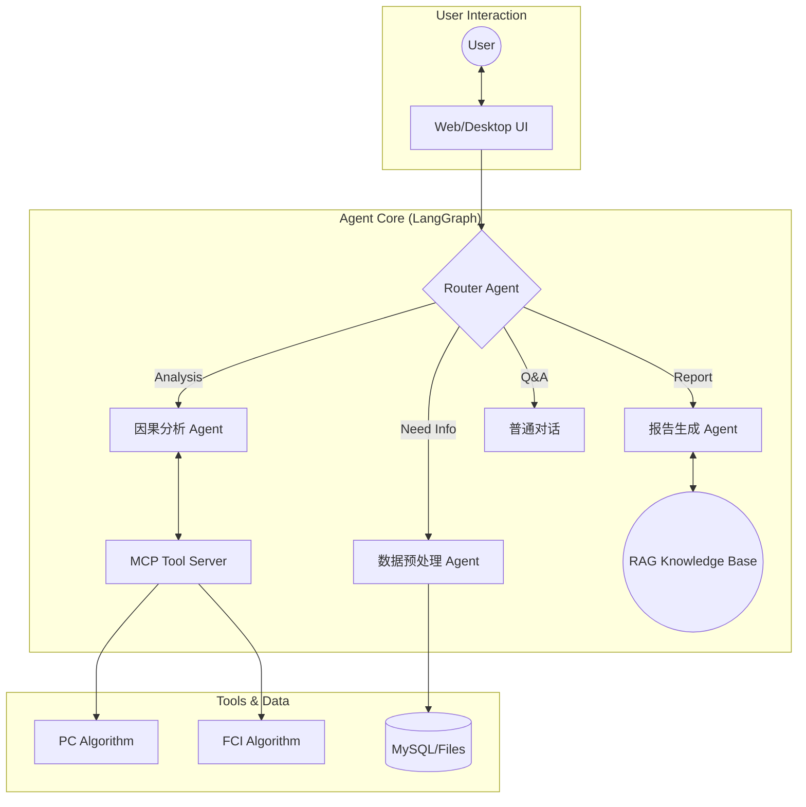

[简体中文](README.md) | [English](README_EN.md)


<p align="center">

</p>

<h1 align="center">
CausalAgent
</h1>

<p align="center">
<em>新一代因果分析智能体</em>
</p>

<p align="center">
    <a href="#">
      
    </a>
    <a href="#">
      
    </a>
    <a href="#">
      
    </a>
    <a href="#">
      
    </a>
  </p>

  <br>

  <p>

*只需上传你的数据集，Causal-Agent 就能以对话的方式，自动帮你选用因果分析算法，并在生成可交互的对话面板和专业的分析报告。*

> [!IMPORTANT]
> **项目开发中**
> <br>
> 目前 CausalAgent 正在进行核心架构升级,我们正在努力完善功能，**请点击右上角 Star ⭐ 关注后续更新！**

## 目录

- [目录](#目录)
- [WHAT IS CausalAgent](#what-is-causalagent)
- [WHY CausalAgent](#why-causalagent)
- [技术栈](#技术栈)
- [展示](#展示)
- [核心功能](#核心功能)
  - [Agent 总览](#agent-总览)
  - [预处理](#预处理)
  - [因果分析（MCP）](#因果分析mcp)
  - [知识库（RAG）](#知识库rag)
  - [后处理](#后处理)
  - [报告生成](#报告生成)
- [快速开始 | Quick Start](#快速开始--quick-start)
  - [Docker部署](#docker部署)
    - [数据库生产化配置](#数据库生产化配置)
  - [windows部署](#windows部署)
- [贡献](#贡献)
- [Star 趋势](#star-趋势)
- [项目结构](#项目结构)
- [更新日志](./README/CHANGELOG.md)


## WHAT IS CausalAgent

**新一代因果分析智能体**: CausalAgent 是一个集成了AGENT的因果分析工具，它能够自动识别因果关系，生成专业的分析报告，并提供可交互的因果图谱。

**缩减因果分析门槛**：什么是因果？为什么需要因果分析？简单来说，[因果分析](https://zh.wikipedia.org/wiki/%E5%9B%A0%E6%9E%9C%E6%8E%A8%E6%96%B7)就是对真实世界数据进行逻辑分析。

## WHY CausalAgent

| 特性 | 说明 |
| :--- | :--- |
| **Agent 驱动** | 基于 LangGraph 的多智能体协作，自动路由任务，无需人工干预算法细节。 |
|  **动态图谱** | 摒弃静态图片，生成可交互的 Network 图谱，支持节点拖拽、点击追问。 |
|  **MCP 架构** | 采用 **Model Context Protocol**，将核心逻辑与工具解耦，极易扩展新算法。 |
|  **RAG 增强** | 内置因果推断领域的专业知识库，确保生成的分析报告学术性与严谨性并存。 |
## 技术栈

| 类别 | 技术组件 |
| :--- | :--- |
| **Core AI** |    |
| **Backend** |    |
| **Frontend** |    |
| **Tools** |   |
## 展示
<p align="center">
  

</p>
<p align="center">
  
</p>

## 核心功能

CausalAgent 的整体因果分析流程可以抽象为：**用户上传数据 → 预处理与数据体检 → 因果结构学习 → 后处理与质量提升 → 报告与可视化输出**。下面按模块进行说明。

### Agent 总览


- **Router Agent**：根据用户意图在「预处理 / 因果分析 / 知识库问答 / 报告生成」等节点之间自动路由，无需用户关心底层算法。
- **Causal Agent**：负责与 MCP 因果算法工具交互（如 PC、FCI 等），完成因果结构学习与干预效应估计的核心推理。
- **Writer Agent**：结合因果结果与 RAG 知识库，自动撰写结构化专业报告（背景、方法、结果、结论与局限性）。
- **Chat Agent**：面向一般问答与解释型对话，为非专业用户提供自然语言解释与操作指引。

### 预处理
*进行基本的数据建模，对数据进行可视化分析，并为后续因果分析做「体检与筛选」*

- **数据概览**：统计数据集的行数、列数和所有字段名，生成统一的表结构摘要，帮助快速理解数据规模与字段含义。
- **列级体检与类型推断**：逐列分析缺失率、唯一值、是否常数列，自动识别连续变量、分类变量、时间变量、疑似 ID 等，并给出每一列在因果分析中的适用性评级（如 *excellent / good / warning*）。
- **质量诊断与因果友好度评估**：汇总整体缺失率，标记高缺失列和常数列，识别高基数分类、疑似 ID 等问题字段，并按适用性分组出「优先用于因果分析」的候选变量列表。
- **可视化摘要**：通过直方图、箱线图、相关性热力图等可视化方式，辅助发现明显异常值和潜在共线性问题。

### 因果分析（MCP）
*基于 MCP（Model Context Protocol）快速迭代因果算法*

- **可插拔算法框架**：通过 MCP 将因果发现与估计算法以「工具」形式解耦，便于在不改动 Agent 主逻辑的前提下扩展/更换算法库。
- **当前支持**：
  - PC 算法（基于条件独立检验的因果结构学习）。
- **规划中**：
  - FCI 等含潜在混杂的结构学习算法；
  - 因果效应估计（ATE/CATE）与反事实分析等模块。

### 知识库（RAG）
*通过嵌入论文与书籍构建因果推断领域知识库，为报告和问答提供专业支撑*

- **嵌入模型**：目前采用 `bge-small-zh-v1.5` 作为中文向量化模型，兼顾性能与效果。
- **知识来源**：使用大量因果推断相关书籍与论文的 PDF / TXT 文档构建，涵盖经典因果图论、干预推断、工具变量、面板因果等主题。
- **典型能力**：
  - 在生成报告时，自动检索相关理论和方法描述，为结论补充严谨的文献背景；
  - 支持面向初学者的「概念解释」，例如“什么是混杂变量”“为什么需要随机试验”等。

### 后处理
*对因果图进行后处理，包括环路检测、边合理性评估等，提高因果结构的可解释性与可靠性*

- **环路检测与修正**：检查学习得到的因果图中是否存在违背 DAG（有向无环图）假设的环路；若发现异常，则调用 LLM 辅助判断合理的断边方案，给出修正建议。
- **边评估与置信度分析**：对每一条因果边进行强度或置信度评估，结合数据统计特征和领域常识，对明显不合理的边进行标记与修正建议。
- **结构约束与业务先验融合**：在后处理阶段支持引入业务先验（如「变量 A 不可能被 B 因果影响」），从而得到更符合领域知识的因果图。

### 报告生成
*根据后处理结果生成面向业务方与研究者的专业报告，并配套交互式可视化*

- **自动生成结构化报告**：围绕「分析背景 → 数据概况 → 方法说明 → 因果发现 → 结论与建议 → 局限性」等章节自动撰写自然语言报告。
- **交互式因果图谱**：基于 vis-network 等前端组件生成可交互的因果图，支持节点拖拽、缩放、查看变量说明、点击追问等操作。

## 快速开始 | Quick Start
### Docker部署
当前项目已经提供了完整的多阶段 `Dockerfile`，会先用 Node 24 构建管理员 Vue，再生成仅包含 Python 运行时与静态产物的应用镜像；暂未在公网镜像仓库发布官方镜像。
如果你已安装 Docker，可以在本地根据下面的步骤自行构建并运行镜像。


1. 安装docker并且gitclone项目
```bash
git clone https://github.com/Heyflyingpig/CausalAgent
```

2. 创建.env文件,并在文件中键入以下值
```bash
# Flask 应用密钥（用于会话加密等）
SECRET_KEY=

# API 基础URL（OpenAI官方或第三方兼容接口）
BASE_URL=
MODEL=
# 可选：第三方 OpenAI 兼容接口通常使用 json_mode。
LLM_STRUCTURED_OUTPUT_METHOD=json_mode

# OpenAI API 密钥或兼容 API 的密钥
API_KEY=
# Docker环境：使用服务名 'mysql'
# 本地开发：使用 'localhost' 或 '127.0.0.1'
MYSQL_HOST=mysql

# 旧版兼容账号。未配置拆分账号时，写/读连接会回退使用它。
MYSQL_USER=pyramid

MYSQL_ROOT_PASSWORD=
MYSQL_PASSWORD=

# 数据库名称
MYSQL_DATABASE=

# 应用写账号：用于主库写入、迁移和数据库就绪检查。
MYSQL_WRITE_USER=pyramid_writer
MYSQL_WRITE_PASSWORD=

# 应用读账号：用于业务查询，并只额外读取 Performance Schema digest 摘要。
MYSQL_READ_USER=pyramid_reader
MYSQL_READ_PASSWORD=

# 复制状态检查账号：只用于 SHOW REPLICA STATUS，缺失时 eventual 读会回退主库。
MYSQL_REPLICA_STATUS_USER=replica_status
MYSQL_REPLICA_STATUS_PASSWORD=

# 复制通道账号：只用于从库拉取主库 binlog。
MYSQL_REPLICATION_USER=replica
MYSQL_REPLICATION_PASSWORD=

MYSQL_WRITE_HOST=mysql-primary
MYSQL_READ_HOSTS=mysql-replica

MYSQL_PORT=3306
MYSQL_POOL_SIZE_WRITE=5
MYSQL_POOL_SIZE_READ=5
MYSQL_REPLICA_MAX_LAG_SECONDS=2
MYSQL_QUERY_WARN_MS=500

# 管理员数据库看板、3.1 只读业务后台与 deep 审计
DB_INSPECTION_QUERY_TIMEOUT_MS=3000
DB_DASHBOARD_CONNECTION_WARNING_PERCENT=70
DB_DASHBOARD_CONNECTION_CRITICAL_PERCENT=85
DB_MONITOR_AUTO_REFRESH_ENABLED=true
DB_MONITOR_REALTIME_INTERVAL_SECONDS=10
DB_MONITOR_SQL_INTERVAL_SECONDS=60
DB_MONITOR_TABLE_CAPACITY_INTERVAL_SECONDS=900
DB_MONITOR_SLOW_QUERY_WARNING_DELTA=1
DB_MONITOR_INTEGRITY_ENABLED=false
DB_MONITOR_INTEGRITY_INTERVAL_SECONDS=86400

# 可选，仅本地管理员 Vue 开发使用；生产环境留空。
ADMIN_VITE_DEV_SERVER_URL=

# Web/后台任务并发配置
WEB_WORKERS=1
WEB_THREADS=12
WEB_TIMEOUT=120
JOB_WORKERS=2
JOB_HEARTBEAT_INTERVAL_SECONDS=10
JOB_STALE_AFTER_SECONDS=120
JOB_MAX_ATTEMPTS=3

MAX_UPLOAD_SIZE_MB=20


# LangSmith API 密钥和项目名称（不强制，兼容原有 LANGCHAIN_* 配置）
LANGCHAIN_API_KEY=
LANGCHAIN_PROJECT=

```
3. 在项目根目录运行docker-compose
```bash
docker-compose -f docker-compose.replica.yml up -d
```

4. 运行数据库迁移
```bash
docker-compose -f docker-compose.replica.yml run --rm app python Database/database_init.py
docker-compose -f docker-compose.replica.yml run --rm app alembic upgrade head
```

全新空库不需要运行升级前审计。只有旧库尚未建立目标外键、且即将执行添加这些外键的迁移时，才先运行：

```bash
docker-compose -f docker-compose.replica.yml run --rm app python Database/audit_before_db_upgrade.py
```

> [!IMPORTANT]
> **知识库仍然在构建，所以知识库查询功能暂不可用**

#### 数据库生产化配置

主从开发：

如果你已经启动过 `mysql-primary` 或 `mysql-replica`，修复后要使用新的空 volume 重建；否则 `/docker-entrypoint-initdb.d` 初始化脚本不会重新执行。

主从模式下数据库账号按职责拆分：

- 写账号：`MYSQL_WRITE_USER` / `MYSQL_WRITE_PASSWORD`，用于应用写主库、Alembic 迁移和启动就绪检查；缺失时兼容回退到 `MYSQL_USER` / `MYSQL_PASSWORD`。
- 读账号：`MYSQL_READ_USER` / `MYSQL_READ_PASSWORD`，用于 `get_read_connection()` 的主库强一致读和从库弱一致读；除业务库 `SELECT` 外，仅额外授予 `performance_schema.events_statements_summary_by_digest` 的表级 `SELECT`，供高负载 SQL digest 摘要使用；缺失时兼容回退到 `MYSQL_USER` / `MYSQL_PASSWORD`。
- 复制状态检查账号：`MYSQL_REPLICA_STATUS_USER` / `MYSQL_REPLICA_STATUS_PASSWORD`，只用于读取 `SHOW REPLICA STATUS`；缺失或不可用时，`eventual` 读安全回退主库读连接。
- 复制通道账号：`MYSQL_REPLICATION_USER` / `MYSQL_REPLICATION_PASSWORD`，只用于 MySQL 主从复制链路，不参与应用业务查询。

删除已经创建的会话时，应用会在同一个主库事务内删除会话、聊天消息、附件和同一 `session_id` 对应的 LangGraph MySQL checkpoint；`checkpoint_writes` 由其到 `checkpoints` 的外键级联删除。当前 `thread_id` 使用会话 ID，但不额外建立 `checkpoints.thread_id → sessions.id` 外键。

管理接口：

- `GET /api/admin/db/dashboard`
- `GET /api/admin/db/health`
- `GET /api/admin/db/overview`
- `GET /api/admin/db/integrity?mode=quick`
- `GET /api/admin/db/slow-queries`
- `GET /api/admin/jobs/workers`
- `POST /api/admin/db/refresh`
- `POST /api/admin/db/integrity/run`
- `GET /api/admin/db/settings`
- `PUT /api/admin/db/settings`
- `POST /api/admin/db/settings/reset`
- `GET /api/admin/db/settings/history?limit=&before_id=`

以上接口只允许数据库中 `role = 'admin'` 且 `is_active = TRUE` 的用户访问。未登录 API 请求返回 `401`，未登录管理员页面回到统一登录入口，普通登录用户返回 `403`；后端会在每次请求时从主库重新确认当前角色和启用状态，不信任浏览器 session 中的角色缓存。登录和 `check_auth` 会增量返回 Session 绑定的 CSRF token，管理员刷新、完整性审计、配置保存和重置必须通过 `X-CSRF-Token` 回传。所有响应都有 `X-Request-ID`；格式合法的上游 ID 会被沿用，否则服务端生成新 ID。

`dashboard` 与兼容 GET 接口只读取 MySQL 中最近一次共享快照，不会随管理员页面数量重复执行完整采集；`refresh` 仅登记实时状态、SQL 性能和表容量的共享刷新请求，返回 `202`，完整性审计由独立的 `integrity/run` 接口触发。旧 `health`、`slow-queries` 和 `jobs/workers` 接口继续保留原有 `data` 类型及旧字段。

独立 monitor 进程通过 `python -m Database.monitor_worker` 启动，使用 MySQL 命名锁合并并发采集，并把 `realtime`、`sql_performance`、`capacity`、`integrity` 四类快照写入 `database_monitor_snapshots`。默认分层周期为：主从/连接/Worker/Job 实时状态 `10` 秒、SQL 性能 `60` 秒、表容量 `900` 秒；完整性定时审计默认关闭，启用后默认每天一次。关闭自动刷新不会影响页面首次读取和手动刷新，monitor 仍会处理手动请求。实时、SQL、容量周期分别只允许 `5～10`、`30～60`、`300～900` 秒，完整性周期至少 `3600` 秒，慢查询增量阈值必须大于 `0`；布尔配置严格使用 `true/false`。

七项采集参数的有效值统一按“`database_monitor_settings` 数据库覆盖 > 环境变量 > 代码默认值”解析，`NULL` 表示继承。Web、dashboard、monitor 和慢查询采集共享同一解析服务，每个进程最多缓存 5 秒；配置保存后当前进程立即失效缓存，其他进程最多 5 秒热加载。数据库读取失败时继续使用最后有效值，没有最后有效值时回退环境变量/默认值并在看板显示降级状态。配置写入使用乐观版本锁，成功、拒绝和失败事件写入 `admin_audit_events`；删除管理员用户不会删除历史审计快照。

“SQL 性能摘要/高负载 SQL”中的 Performance Schema digest 按累计 `SUM_TIMER_WAIT` 排序，不表示单次执行时间超过 `long_query_time`；`slow_query_log`、`long_query_time` 和 `Slow_queries` 仍表示 MySQL 慢查询配置与状态。看板主要用采集窗口内 `Slow_queries` 增量告警，默认增量达到 `1` 进入 warning，启动以来累计值仅作辅助信息。

管理员登录或恢复会话后仍以 `/admin/database` 为落点，不进入聊天界面；普通用户继续进入原聊天界面。管理员后台位于独立的 `admin-frontend/` Vue 3 + TypeScript + Element Plus 应用，现提供业务概览、用户、会话/消息、任务/事件、文件资产、数据库看板、采集配置与 Schema/deep 审计页面。左侧导航在桌面端可在 `248px` 和约 `76px` 间收缩并保存浏览器偏好，移动端使用可关闭抽屉；展开和折叠状态均复用受保护接口返回的 `README/CausalAgent.png` 原图。

3.1 业务页面只做有界、主库强一致读取，不提供用户启停、角色修改、改密、删除、任务控制、SQL、迁移或复制控制。列表默认 20 条、最多 50 条，使用不透明游标；密码哈希、正文、文件 BLOB/哈希、Cookie、Token、账号 host 和 grants 不进入列表 DTO。消息、附件以及任务输入/结果/错误只在管理员明确点击后通过最多 `64 KiB` 的分块接口读取，成功敏感读取需要审计可写，否则失败关闭。CSV 预览只以文本展示，最多读取 `256 KiB`、100 行、50 列、单元格 1000 字符；预览或下载成功会在同一事务中增加 `access_count`、更新 `last_accessed_at` 并写入不含正文的访问审计。

数据库审计提供 quick 和 deep 两种共享快照。deep 只能手动登记，由独立 monitor 执行 revision、关键 schema、运行时、账号职责、Job/Event、checkpoint/pending writes、归档关系、`active_session_key` 和逐从库状态检查；它永不定时调度、不自动修复，也不返回真实账号、host 或 grants。普通用户的 Flask 静态 HTML/CSS/JavaScript 与聊天 API、Job/Event 和 SSE 契约保持不变。连接使用率默认在 `70%` 进入 warning、`85%` 进入 error；单条检查 SELECT 默认最多执行 `3000ms`。

管理员前端开发与验证：

```bash
cd admin-frontend
npm ci
npm run typecheck
npm run test:unit
npm run test:e2e:mock
npm run build
```

3.1 的真实写副作用与迁移往返只在独立临时主从中验收。先完成上述生产构建，再从仓库根目录运行：

```powershell
powershell -ExecutionPolicy Bypass -File tests/run_admin_31_e2e.ps1
```

脚本使用 `docker-compose.replica.yml` 与 `docker-compose.admin-e2e.yml`，生成仅存在于进程环境中的临时凭据，并使用 `127.0.0.1:13317` / `127.0.0.2:13317` 和 Web `15011`，不会迁移或写入当前开发库。为遵守清理门禁，脚本只停止自己启动的 Flask/monitor 进程，结束后会保留明确命名的 `causalchat31e2e_*` 数据库容器和项目卷；确认后再单独清理。

真实 Flask + monitor + 隔离 MySQL 的 Playwright 流程需要提供
`PLAYWRIGHT_BASE_URL`、`PLAYWRIGHT_ADMIN_USERNAME`、`PLAYWRIGHT_ADMIN_PASSWORD`、
`PLAYWRIGHT_USER_USERNAME` 和 `PLAYWRIGHT_USER_PASSWORD` 后执行
`npm run test:e2e`。本机没有当前 Playwright Chromium 构件时，可显式设置
`PLAYWRIGHT_CHANNEL=msedge` 复用已安装的 Edge；CI 未设置时仍使用标准 Chromium。

Vite 固定使用 `/admin/` base，并只在开发模式代理 `/api` 到 Flask。只有显式设置 `ADMIN_VITE_DEV_SERVER_URL=http://127.0.0.1:5173` 时，Flask 完成页面鉴权后才跳转到 Vite；未配置时 Flask 托管生产构建。Dockerfile 使用 Node 24 构建阶段生成 Vue 产物，并把产物复制到最终 Python 镜像的 `/opt/causalchat-admin`；最终镜像不包含 Node 运行时、不启动 Vite，也不开放 Node 端口。发布回滚以迁移前基线提交或上一版镜像为单位，不提供长期 legacy 管理路由。

执行包含 `users.role` 的最新 Alembic migration 后，可以把一个已经注册且已启用的用户提升为初始管理员：

```bash
python -m app.auth.admin_cli promote <username> ----本地运行
docker-compose -f docker-compose.replica.yml run --rm app python -m app.auth.admin_cli promote <username> ----docker运行
```

该命令只支持幂等提升，不创建账号、不降级管理员，也不提供 Web 角色修改入口。目标用户不存在或已禁用时不会修改数据库。


### windows部署

**不推荐使用windows部署，会有意想不到的问题**

普通用户前端仍由 Flask 直接托管；管理员 Vue 在开发时可单独运行 Vite，生产时由 Flask 托管预构建产物。长任务仍需要独立 worker，数据库看板仍需要独立 monitor。

首先推荐创建一个环境，具体创建方式请自行查阅

1. 打开命令行工具。

2. 导航到您想要存放项目的目录。 （例如，如果您想放在 D 盘的 Projects 文件夹下，可以输入 cd /d D:\Projects）

3. 克隆仓库: 输入以下命令并按回车：

  git clone https://github.com/Heyflyingpig/CausalAgent
  这将在当前目录下创建一个名为 CausalAgent 的文件夹，并下载所有项目文件。

*备选方案：您也可以在 GitHub 页面上点击 "Code" -> "Download ZIP" 下载项目的压缩包，然后手动解压。*


4.  **Python 环境**: 确保你已安装 Python 3.11+。

5.  **MySQL 数据库**: 你需要一个正在运行的 MySQL 8.0+ 实例。请预先创建一个数据库（例如，名为 `causal_chat_db`）并准备好其访问凭据（主机、用户名、密码）。

6.  **安装 Python 依赖**:
    克隆项目后，在项目根目录运行以下命令：
    ```bash
    pip install -r requirements.txt
    ```

   管理员 Vue 需要 Node 24；首次或锁文件变化后构建一次：

    ```bash
    cd admin-frontend
    npm ci
    npm run build
    cd ..
    ```
7. 项目配置

在首次运行前，你必须在项目根目录下创建一个 `.env` 文件，用于存放所有敏感配置信息。

-   创建 `.env` 文件。
-   将以下模板内容复制到文件中，并填入你自己的真实信息。

    ```bash
    # Flask 应用密钥（用于会话加密等）
    SECRET_KEY=

    # API 基础URL（OpenAI官方或第三方兼容接口）
    BASE_URL=
    MODEL=
    # 可选：第三方 OpenAI 兼容接口通常使用 json_mode。
    LLM_STRUCTURED_OUTPUT_METHOD=json_mode

    # OpenAI API 密钥或兼容 API 的密钥
    API_KEY=
    # Docker环境：使用服务名 'mysql'
    # 本地开发：使用 'localhost' 或 '127.0.0.1'
    MYSQL_HOST=mysql

    # 旧版兼容账号。未配置拆分账号时，写/读连接会回退使用它。
    MYSQL_USER=

    MYSQL_ROOT_PASSWORD=
    MYSQL_PASSWORD=

    # 数据库名称
    MYSQL_DATABASE=

    # 应用写账号
    MYSQL_WRITE_USER=
    MYSQL_WRITE_PASSWORD=

    # 应用读账号
    MYSQL_READ_USER=
    MYSQL_READ_PASSWORD=

    # 复制状态检查账号。缺失时 eventual 读回退主库。
    MYSQL_REPLICA_STATUS_USER=
    MYSQL_REPLICA_STATUS_PASSWORD=

    # 复制通道账号
    MYSQL_REPLICATION_USER=replica
    MYSQL_REPLICATION_PASSWORD=

    # 管理员数据库看板共享快照
    DB_INSPECTION_QUERY_TIMEOUT_MS=3000
    DB_DASHBOARD_CONNECTION_WARNING_PERCENT=70
    DB_DASHBOARD_CONNECTION_CRITICAL_PERCENT=85
    DB_MONITOR_AUTO_REFRESH_ENABLED=true
    DB_MONITOR_REALTIME_INTERVAL_SECONDS=10
    DB_MONITOR_SQL_INTERVAL_SECONDS=60
    DB_MONITOR_TABLE_CAPACITY_INTERVAL_SECONDS=900
    DB_MONITOR_SLOW_QUERY_WARNING_DELTA=1
    DB_MONITOR_INTEGRITY_ENABLED=false
    DB_MONITOR_INTEGRITY_INTERVAL_SECONDS=86400

    # 可选，仅本地管理员 Vue 开发使用；生产环境留空。
    ADMIN_VITE_DEV_SERVER_URL=

    # LangSmith API 密钥和项目名称（不强制，兼容原有 LANGCHAIN_* 配置）
    LANGCHAIN_API_KEY=
    LANGCHAIN_PROJECT=

    ```

8. 启动数据库
需要预先安装mysql数据库
在项目根目录下打开一个终端，运行以下命令：
```bash
python Database/database_init.py
alembic upgrade head
```
`Database/database_init.py` 负责确保数据库存在和连接可用；业务表结构由 Alembic 迁移脚本维护。全新空库直接执行 `alembic upgrade head`，不要先运行 preflight。旧库只有在目标外键尚未建立、且即将执行添加外键的迁移时，才先执行 `python Database/audit_before_db_upgrade.py`；审计会依据当前 schema 跳过尚不存在或已经受约束保护的关系。

9. 启动后端服务

在项目根目录下打开一个终端，运行 Web 层：

```bash
python Causalchat.py
```

再打开一个终端，运行后台 worker：

```bash
python -m app.agent.worker
```

再打开一个终端，运行数据库监控采集器：

```bash
python -m Database.monitor_worker
```

首次运行时，Web 层会检查数据库表结构。Agent/MCP 初始化只在 worker 中执行；如果没有 worker，前端可以创建任务但不会得到最终分析结果。数据库看板的共享快照只由 monitor 更新；如果没有 monitor，管理接口仍可读取已有快照并显示过期状态，但不会得到新的自动或手动采集结果。请保持 Web、worker 和 monitor 三个终端窗口持续运行。

10. 启动前端应用

再打开一个 **新的终端窗口**，同样在项目根目录下，运行以下命令：

```bash
python Run_causal.py
```

稍等片刻，一个标题为 "CausalAgent" 的桌面应用窗口将会出现，并加载应用的登录界面。现在，你可以注册并开始使用了。

11. rag和知识库部分
> [!IMPORTANT]
> **知识库仍然在构建，所以知识库查询功能暂不可用**

## 贡献
欢迎提交 Issue 和 Pull Request！

1. Fork 本项目

2. 新建 Feat_xxx 分支

3. 提交代码

4. 新建 Pull Request

## Star 趋势

[](https://star-history.com/#Heyflyingpig/CausalAgent&Date)


## 项目结构

```
.
├── Causalchat.py           # Flask 后端入口
├── Run_causal.py           # 桌面端启动入口（pywebview）
├── requirements.txt        # 完整依赖
├── requirements-base.txt   # 基础依赖（docker/生产使用）
├── Dockerfile
├── docker-compose.yml
├── docker-compose.prod.yml
├── docker-compose.replica.yml # MySQL 主从开发拓扑
├── docker-compose.admin-e2e.yml # 3.1 独立主从验收端口/容器覆盖
├── README.md               # 项目说明
├── README/                 # README 图片与更新日志
├── admin-frontend/         # Vue 3 + TypeScript 管理员后台
│   ├── src/
│   ├── tests/
│   ├── package.json
│   └── package-lock.json
├── database_init.log       # 数据库初始化日志
├── app/                    # Flask 应用主目录（Blueprint 结构）
│   ├── __init__.py         # 创建 Flask app，注册蓝图
│   ├── db.py               # 数据库会话与连接封装
│   ├── main/               # 通用页面相关路由
│   ├── auth/               # 登录、注册等认证相关路由
│   ├── admin/              # 管理 API、审计服务与受保护 Vue 入口
│   ├── chat/               # 聊天 & 会话相关路由与服务
│   ├── files/              # 文件上传/管理相关路由
│   └── static/             # 前端静态资源
│       ├── chat.html       # 主聊天界面
│       ├── css/
│       ├── js/
│       └── generated_graphs/ # 因果图等生成图像
├── Agent/                  # 因果分析与智能体核心逻辑
│   ├── causal/             # 底层因果发现算法
│   ├── causal_agent/       # langgraph/agent 状态、节点定义
│   ├── Processing/         # 数据预处理、折叠验证、可视化
│   ├── Postprocessing/     # 后处理
│   ├── Report/             # 报告生成逻辑
│   ├── knowledge_base/     # RAG 知识库
│   │   ├── build_knowledge.py
|   |   ├── query_rag.py
│   │   ├── db/             # 向量知识库存储
│   │   └── models/         # 嵌入模型
│   └── tool_node/          # MCP 工具节点封装（task、rag 调用等）
├── Database/               # 数据库初始化与迁移逻辑
│   ├── database_init.py    # 数据库初始化引导脚本
│   ├── audit_before_db_upgrade.py # 数据库生产化升级前审计
│   ├── inspection.py       # 管理员看板统一只读检查服务
│   ├── deep_audit.py       # 3.1 手动 deep 数据库事实审计
│   ├── monitoring.py       # 共享快照存取、调度与兼容接口
│   ├── monitor_settings.py # 在线配置解析、缓存、校验与事务写入
│   ├── monitor_worker.py   # 数据库看板分层采集进程
│   ├── agent_connect.py    # Langgraph checkpoint 相关数据库支持
│   ├── mysql/              # MySQL 主从配置与初始化脚本
│   └── migrations/         # Alembic 迁移脚本
├── config/                 # 全局配置
│   └── settings.py
├── setting/                # 用户可见文档
│   ├── manual.md           # 用户手册
│   └── Userprivacy.md      # 用户隐私协议
├── openspec/               # 项目规范与变更说明（内部开发用）
```
